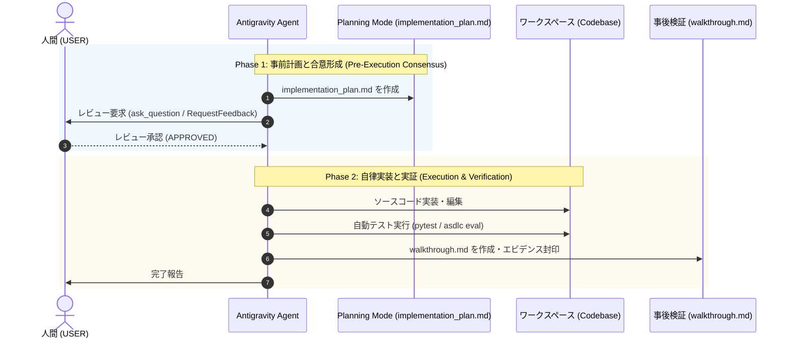

# Google Antigravity Two-Phase Governance Skill

本スキルは、Google Antigravity 環境において AI エージェントの自律変更を安全に統制するための **「二段階ガバナンス (Two-Phase Evidence & Review)」** 手続きを規定します。

---

## 1. Phase 1: 事前計画と人間承認 (Planning Mode)

エージェントはいかなる非自明なソースコード変更も、人間による明示的承認を得る前に行ってはなりません。

### 手順
1. **公式計画アーティファクトの作成**:
   - Antigravity 公式アーティファクトである `implementation_plan.md` を作成。
   - 配置パス: `<appDataDir>\brain\<conversation-id>/implementation_plan.md`
   - **必須定型見出しの厳格遵守** (UI パーサーが「実行可能計画」と認識して Proceed ボタンを表示するために必須):
     - `# [Goal Description]`
     - `## User Review Required`
     - `## Open Questions` (なければ "None" と明記)
     - `## Proposed Changes` (日本語化せず英語見出しを維持)
     - `## Verification Plan` (日本語化せず英語見出しを維持)
2. **メタデータによる Proceed ボタンのトリガー**:
   - `write_to_file` 時に必ず `ArtifactMetadata` を設定する:
     - `RequestFeedback: true`
     - `UserFacing: true`
     - `Summary: "<詳細サマリー>"`
   - **注意: `ask_question` ツールの禁止**: Planning Mode において `ask_question` を呼び出すことは Antigravity 公式規約で禁止されています。疑問点はすべて `## Open Questions` に記載し、承認は UI の [Proceed] ボタンに一任します。
3. **ターンの即時終了と待機**:
   - 計画アーティファクト作成後は、チャットで計画内容を再要約せず、ユーザーに [Proceed] ボタンの押下を促してツール呼び出しを終了（ターン終了）します。
4. **承認の確認**:
   - ユーザーが [Proceed] ボタンを押下（`<USER_REQUEST>Proceed</USER_REQUEST>`）するか、明示的承認を与えるまで、コード変更ツール（ソース編集・コマンド実行等）の実行を停止（ブロック）します。

---

## 2. Phase 2: 自律実行と事後検証 (Walkthrough Sealing)

承認を得た後、エージェントは自律的に実装を実行し、事後エビデンスを封印します。

### 手順
1. **安全な実装**:
   - 計画に記載されたファイルのみを変更し、計画外のスコープ逸脱を行わない。
   - 変更の最小化と、既存のコメント・スタイルの維持。
2. **検証テストの自動実行**:
   - `pytest` 等の自動テストスイートを実行。
   - 失敗した場合は直ちに自己修復し、すべてのテストがグリーンになるまで検証を継続。
3. **CLI 実機検証**:
   - CLI ツール（`asdlc status`, `asdlc eval` 等）を実行し、実際の挙動を確認。
4. **`walkthrough.md` の出力**:
   - 配置パス: `<appDataDir>\brain\<conversation-id>/walkthrough.md`
   - 実装内容、実行されたテストログ、検証結果、Before/After 差分を記録。
   - `ArtifactMetadata(UserFacing=true, RequestFeedback=false)` を設定。
5. **ユーザーへの最終完了報告**:
   - 成果物リンク（`spec.md`, `plan.md`, `implementation.md`, `walkthrough.md`）を提示して完了を報告。
