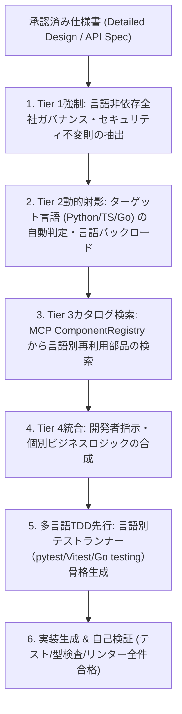

# ASDLC Coding Agent Skill

本スキルは、承認済み仕様書（要件定義書・詳細設計書）に基づき、**4層知識優先構造 (4-Tier Knowledge Hierarchy)** と **多言語コンポーザブル知財再利用** を強制して標準化されたプロダクションコードを自動合成する手順を定めます。

---

## 1. 4層知識優先階層の適用手順



### 手順 1: 全社普遍ガバナンスルールのバインド (Tier 1: Language-Agnostic Core)
- 認証・認可境界（RBAC/OAuth2/JWT）の必須化。
- 平文APIキー・パスワードの混入検査（環境変数やシークレットマネージャ経由への置換）。
- TLS暗号化通信の強制、SQLインジェクション対策（ORM/パラメータ化プレースホルダー強制）。
- クリーンアーキテクチャ・単一責任の原則（SRP）の強制。

### 手順 2: ターゲット言語の判定と特化パックの動的射影 (Tier 2: Language Pack)
- プロンプト、ファイル名、またはCLI引数（`--lang`）から対象言語（Python, TypeScript, Go, C, C++, C# 等）を自動検出。
- 該当言語の最新標準・型安全基準・規約（Python: Pydantic v2/Ruff, TypeScript: Strict Mode/Zod, Go: Effective Go, C/C++: C17/C++23/RAII, C#: C# 12/Nullable/xUnit）のみをコンテキストに射影。不要言語のルールを排除してトークンを節約し注意機構を保護。

### 手順 3: 多言語コンポーネントカタログのセマンティック検索 (Tier 3: Polyglot Catalog)
- 要求された基盤機能（認証、DB接続、ロギング、キャッシュ、UIテーブル等）について、MCP Knowledge Base を対象言語属性付きで検索。
- 一致する既存コンポーネントが検知された場合、独自実装を禁止し、社内標準ライブラリの正規インポート文を生成。

### 手順 4: プロンプト要求とビジネスロジックの合成 (Tier 4: Local Intent)
- 上位制約（Tier 1〜3）の境界を維持しつつ、ユーザーが求めたドメイン固有のビジネスロジックを実装。

### 手順 5: 多言語 TDD テスト自動生成と実行検証
- 仕様書の Given-When-Then 条件に対応する対象言語のテスト関数（Python: `test_*.py`, TS: `*.test.ts`, Go: `*_test.go`, C: `test_*.c`, C++: `*_test.cpp`, C#: `*Tests.cs`）を先行生成。
- 対象言語のテストランナー（`pytest`, `vitest`, `go test`, `ctest`/GoogleTest, `dotnet test`）を実行し、全テスト合格（Green）を確認。

---

## 2. CLI 実行方法

```bash
# 自動判定によるコーディングコンテキスト合成
asdlc code "ユーザー一覧テーブル表示とJWT認証ログインAPIの実装"

# 言語を明示指定して実行
asdlc code "高スループット監査ログ収集gRPCマイクロサービス" --lang go
asdlc code "ReactデータグリッドとOAuthログイン画面" --lang typescript
asdlc code "FastAPIとPydanticを用いた商品マスタAPI" --lang python
asdlc code "高信頼組込みセキュアバッファ制御モジュール" --lang c
asdlc code "低レイテンシ金融マッチングエンジン" --lang cpp
asdlc code "ASP.NET CoreとEntity Frameworkを用いた決済マイクロサービス" --lang csharp
```

---

## 3. 遵守基準
- 未テストのコードを納品してはならない（Test Coverage 100%を目指す）。
- 循環参照や密結合を避け、静的型付け（Pydantic, TypeScript Strict, Go struct）を厳格に適用すること。

