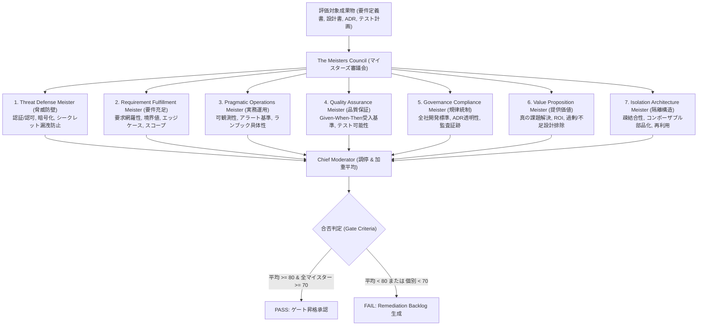

# ASDLC Meisters Review Skill (マイスターズレビュー審査スキル)

本スキルは、公式憲章 [docs/charter/MEISTERS_CHARTER.md](file:///docs/charter/MEISTERS_CHARTER.md) に基づき、ウォーターフォール各フェーズの中間成果物（要件定義書、基本設計書、ADR、詳細設計書等）を「マイスターズ審議会（The Meisters Council）」により厳格審査し、品質ゲートとして合否を判定する公式手続きを定めます。

---

## 1. マイスターズ審議会の7大マイスターと審査ルーブリック

各マイスターは、以下の詳細評価基準に基づき **0〜100点** で独立採点を行います。



### マイスター別審査ルーブリック (Scoring Rubrics)

| マイスター | 減点・失格基準 (FAIL要因) | 加点・合格基準 (70点以上) |
| :--- | :--- | :--- |
| **1. Threat Defense** | 機密情報・APIキーの平文露出、認証認可の欠落、SPOF未考慮 (-30点) | TLS暗号化、RBAC、レートリミット、脅威モデリング明記 (+20点) |
| **2. Requirement Fulfillment** | 「TBD」放置、正常系のみで異常系・境界値の欠落 (-25点) | 網羅的ユースケース、事前事後条件、対象外スコープ明確化 (+20点) |
| **3. Pragmatic Operations** | 「手動で対応」等の曖昧記述、ログ/メトリクス設計欠落 (-25点) | 障害時ロールバック手順、SLI/SLO、アラート閾値明記 (+20点) |
| **4. Quality Assurance** | 受入基準の欠落、「使いやすいこと」等の主観的記述 (-25点) | Given-When-Then形式の受入基準、自動テスト計画の網羅 (+20点) |
| **5. Governance Compliance** | 技術選定理由（ADR）の未記載、全社命名規則違反 (-25点) | トレードオフ明記のADR、法規制/ライセンス適合性明記 (+20点) |
| **6. Value Proposition** | 開発者趣味の過剰設計（Over-engineering）、ROI不適合 (-25点) | 定量的な顧客価値、開発規模に見合った技術スタック選定 (+20点) |
| **7. Isolation Architecture** | モジュール間の循環参照、既存知財の重複再実装 (-30点) | 疎結合インターフェース、MCPコンポーネント再利用前提 (+20点) |

---

## 2. ゲート通過判定アルゴリズム (Gate Criteria)

1. **加重平均スコア ($S_{total}$)**:
   $$S_{total} = \frac{1}{N} \sum_{i=1}^{N} s_i$$
2. **最低スコア ($S_{min}$)**:
   $$S_{min} = \min_{i} (s_i)$$
3. **総合判定 (Verdict)**:
   - **PASS**: $S_{total} \ge 80.0$ かつ $S_{min} \ge 70.0$
   - **FAIL**: $S_{total} < 80.0$ または $S_{min} < 70.0$
   - ※ 1人でもマイスターが70点未満を下回った場合、平均が80点を超えていても即座に `FAIL` となる「足切り防壁」ルールを適用。

---

## 3. CLI 実行手順

```bash
# 対象ドキュメントの審査実行
asdlc review docs/spec/detailed_design.md
```

審査完了後、ターミナルに各マイスターの点数、合否、および具体的改善提案（Recommendations）を掲載した「マイスターズ審議会 評価スコアシート」が出力されます。
`FAIL` の場合は、スキル [asdlc-remediation-loop](file:///.agents/skills/asdlc-remediation-loop/SKILL.md) を起動してドキュメントの修正を行います。
