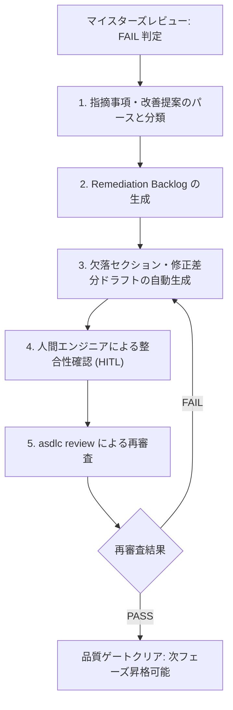

# ASDLC Remediation Loop Skill

本スキルは、マイスターズレビューにおいて成果物が `FAIL` 判定（総合スコア $< 80$ または 個別スコア $< 70$）を受けた際に、マイスターズ審議会の指摘事項を構造化された **Remediation Backlog (是正タスク一覧)** へと変換し、修正と再受審を自動推進する手続きを定めます。

---

## 1. 是正ループの実行フロー



---

## 2. 指摘分類と自動生成テンプレート

マイスターの指摘傾向に応じ、以下の補完テンプレートを適用してドキュメントを拡充します。

### パターン A: Threat Defense 指摘 (セキュリティ不足)
- **対策章節の追加**:
  ```markdown
  ## セキュリティおよびアクセス制御設計
  - **認証方式**: JWT (RS256署名, 有効期限15分) + Refresh Token (HttpOnly Cookie)
  - **認可制御**: RBAC (管理者: `admin`, 一般ユーザー: `member`)
  - **シークレット管理**: 機密情報はすべて環境変数またはSecret Managerより注入し、平文ハードコードを禁止。
  ```

### パターン B: Quality Assurance 指摘 (受入基準不足)
- **受入基準の Given-When-Then 化**:
  ```markdown
  ## 受入基準 (Acceptance Criteria)
  - **AC-01 (正常系)**:
    - Given: 有効なセッションCookieを持つ認証済みユーザー
    - When: プロフィール更新APIに有効な表示名を送信
    - Then: 200 OKが返却され、DBのレコードが更新されること
  ```

### パターン C: Pragmatic Operations 指摘 (運用・監視設計不足)
- **可観測性・ランブック章節の追加**:
  ```markdown
  ## 運用および障害時対応方針
  - **ヘルスチェック**: `/healthz` によるL7死活監視 (応答遅延閾値: 500ms)
  - **アラート基準**: 5xxエラー率が直近5分で 1% を超過した場合にPagerDuty発報
  - **ロールバック方針**: デプロイ障害時はBlue/Green切り替えにより1分以内に旧版へ即時切り戻し
  ```

---

## 3. 再審査と記録
- ドキュメント修正後、`asdlc review <doc>` を再実行。
- PASS判定を獲得した時点で、是正履歴（Before/After）を `Proof of Review` ログに自動記録する。
