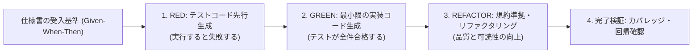

# ASDLC TDD Synthesis Skill

本スキルは、要件定義書および詳細設計書に記載された受入基準（Given-When-Then形式）から、実装に先立って自動テストスイートを先行生成し、**TDD (Test-Driven Development)** サイクルを自律実行する手続きを定めます。

---

## 1. TDD 自律サイクル



---

## 2. 受入基準からテストコードへの変換仕様

### 入力仕様書 (Given-When-Then 例)
```markdown
### 受入基準 1: 有効なトークンによるログイン
- **Given**: 有効な署名と期限内のJWTトークンが付与されたリクエストヘッダー
- **When**: `/api/v1/user/profile` エンドポイントをGET呼び出し
- **Then**: ステータスコード 200 OK とユーザー詳細JSONが返却されること

### 受入基準 2: 期限切れトークンの遮断
- **Given**: 有効期限が過去時刻のJWTトークン
- **When**: `/api/v1/user/profile` エンドポイントをGET呼び出し
- **Then**: ステータスコード 401 Unauthorized とエラー理由コード `TOKEN_EXPIRED` が返却されること
```

### 生成される pytest コード (`tests/test_auth_profile.py`)
```python
import pytest
from datetime import datetime, timedelta
from app.auth import create_token, verify_token

def test_valid_token_returns_profile():
    # Given
    token = create_token(user_id="user_123", expires_in=timedelta(hours=1))
    
    # When
    result = verify_token(token)
    
    # Then
    assert result["valid"] is True
    assert result["user_id"] == "user_123"

def test_expired_token_returns_unauthorized():
    # Given
    expired_token = create_token(user_id="user_123", expires_in=timedelta(seconds=-1))
    
    # When / Then
    with pytest.raises(ValueError, match="TOKEN_EXPIRED"):
        verify_token(expired_token)
```

---

## 3. テスト実行と判定基準
- テスト実行コマンド: `pytest -v tests/`
- 合格基準: エラー0件、失敗0件。境界値および例外系のテストケースが含まれていること。
