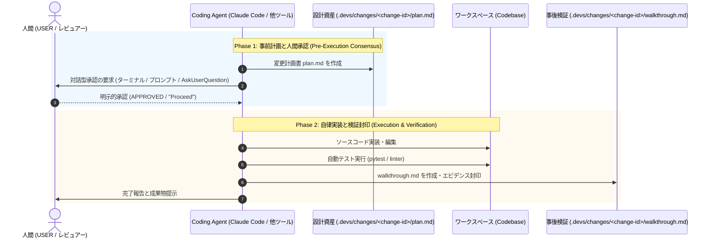

# Universal Two-Phase Governance Skill (CLI / 外部コーディングツール用)

本スキルは、Google Antigravity 以外の AI コーディングツール（**Claude Code**、**Cursor**、**Gemini CLI**、**GitHub Copilot Workspace** 等）において、AI エージェントによる自律コード変更を安全に統制するための **「普遍的二段階ガバナンス (Two-Phase Consensus & Walkthrough)」** 手続きを規定します。

> [!NOTE]
> **適用対象**: Google Antigravity 環境では、UI 連動の [antigravity-two-phase-governance](../antigravity-two-phase-governance/SKILL.md) を使用してください。本スキルは Antigravity 固有の `ArtifactMetadata` や `brain` ディレクトリに依存せず、**リポジトリローカルの成果物ディレクトリ (`.devs/changes/`)** を起点とした標準的対話型承認プロセスを提供します。



---

## 1. Phase 1: 事前計画と人間承認 (Pre-Execution Consensus)

エージェントはいかなる非自明なソースコード変更も、人間による明示的な承認を得る前に行ってはなりません。

### 手順
1. **変更 ID (change-id) の決定とディレクトリ準備**:
   - 作業対象の変更に対して、一意の ID（例: `feat-auth-jwt`, `fix-cors-middleware` 等）を付与。
   - 配置パス: `.devs/changes/<change-id>/`
2. **変更計画書 (`plan.md`) の作成**:
   - `.devs/changes/<change-id>/plan.md` を作成。
   - 必須記載事項：
     - **変更の目的と背景**: 解決する課題、関連 Issue。
     - **影響範囲と変更対象ファイル一覧**: 追加・変更・削除するファイルと責務。
     - **仕様受入基準 (Given-When-Then)**: 動作確認のための客観的基準。
     - **検証計画**: 実行する自動テストコマンドおよび手動確認項目。
3. **対話型承認の要求**:
   - ツール固有の対話機構（例: Claude Code の `AskUserQuestion`、プロンプトでの確認等）を用いてユーザーに計画の確認を求めます。
   - 例:
     > 「変更計画書 `.devs/changes/<change-id>/plan.md` を作成しました。計画内容をご確認の上、実装着手を承認される場合は 'Proceed' または '承認' とご返信ください。」
4. **自律停止と承認待機**:
   - ユーザーからの明示的合意が得られるまで、ソースコードの編集ツールやビルドコマンドの実行を物理的にブロックします。

---

## 2. Phase 2: 自律実装と事後検証 (Execution & Walkthrough Sealing)

ユーザーからの承認受領後、エージェントは自律的に実装および検証を実施します。

### 手順
1. **計画に忠実な実装**:
   - `plan.md` に定義したファイル・コンポーネントのみを変更。
   - 全社ガバナンス規約（[asdlc-coding-rules.md](../../rules/asdlc-coding-rules.md)）を厳格遵守。
2. **自動テストと静的検証の完遂**:
   - テストスイートの実行：
     ```bash
     python -m pytest
     ```
   - ASDLC 評価スイートの実行：
     ```bash
     python -m asdlc.cli.main eval
     ```
   - 全件 Green（100% 合格）になるまで自律修正を継続。
3. **事後検証エビデンス (`walkthrough.md`) の出力**:
   - 配置パス: `.devs/changes/<change-id>/walkthrough.md`
   - 実装差分要約、実行されたテストログ、動作確認エビデンスを克明に記録。
4. **完了報告**:
   - ユーザーへ完了を報告し、作成された `plan.md` および `walkthrough.md` へのリンクを提示。
