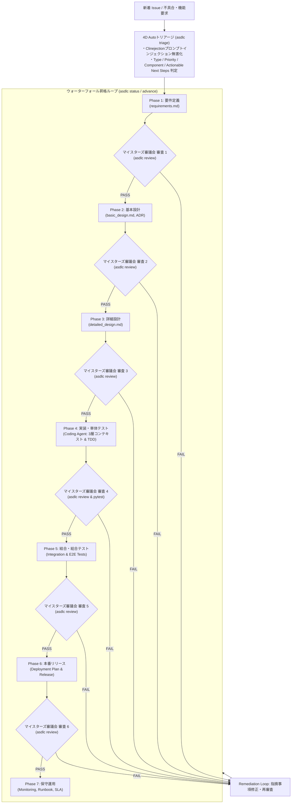

# ASDLC Full Lifecycle Workflow (全体開発ライフサイクル標準手順)

本ワークフローは、Issueの着信から自動トリアージ、ウォーターフォール各工程（Phase 1〜7）、マイスターズ審議会による品質ゲート、および Coding Agent によるコード合成に至る、**ASDLC エンドツーエンドの全体運用手順**を定めたものです。

---

## 🗺️ 全体オーケストレーションマップ



---

## 🌟 開発者の日常コマンドフロー

```bash
# 1. 新着Issueの自動分析とセキュリティ検査
asdlc triage "ユーザー一覧表示時にJWT期限切れで500エラーになる"

# 2. 現在のプロジェクト進行度とゲート状態を確認
asdlc status

# 3. 作成した仕様書をマイスターズ審議会に提出して審査
asdlc review docs/spec/detailed_design.md

# 4. 審査合格後、次フェーズへ安全に昇格
asdlc advance

# 5. Coding Agent による 3層コンテキスト優先コード合成
asdlc code "JWT期限切れ時に401 Unauthorizedとリフレッシュ案内を返却するハンドラー"
```
