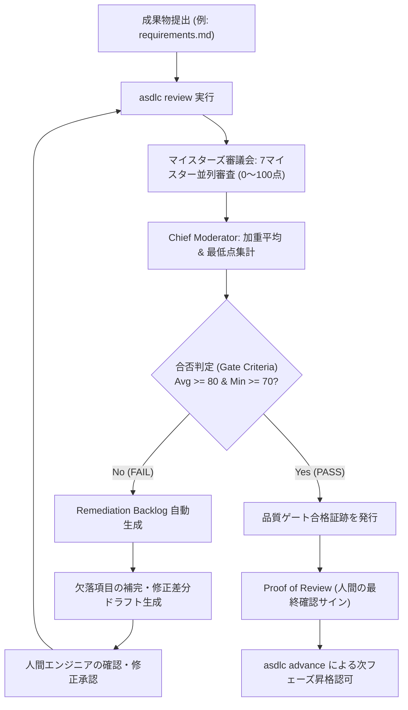

# QA Gate Workflow (マイスターズ審議会 品質ゲート標準手順)

本ワークフローは、各開発フェーズの中間成果物（要件定義書、基本設計書、ADR、詳細設計書等）をマイスターズ審議会で審査し、合否判定および是正（Remediation）を経て品質ゲートを通過させる手順（SOP）を定めたものです。

---

## 🔄 審査・判定・是正フロー図

---

## 📋 ステップ別詳細手順

### Step 1: 成果物の審査実行
- コマンドラインから `asdlc review <doc>` を実行。
- 7名の専門マイスターが独立してルーブリック審査を実施。
  1. Threat Defense Meister
  2. Requirement Fulfillment Meister
  3. Pragmatic Operations Meister
  4. Quality Assurance Meister
  5. Governance Compliance Meister
  6. Value Proposition Meister
  7. Isolation Architecture Meister

### Step 2: 評価スコアシートの確認
- ターミナルに各マイスターの点数と個別判定（PASS/FAIL）が出力される。
- **総合合格基準**:
  - 全マイスター平均点 $\ge 80.0$ 点
  - かつ、全マイスター個別点 $\ge 70.0$ 点（足切りなし）

### Step 3: FAIL時の是正ループ（Remediation Loop）
- 判定が `FAIL` の場合、指摘事項が構造化された「Remediation Backlog」が出力される。
- スキル `asdlc-remediation-loop` を適用し、セキュリティ要件、Given-When-Then受入基準、ランブック等の不足章節を自動起草。
- 人間が内容を点検し、再度 `asdlc review <doc>` を受審。

### Step 4: ゲート通過とフェーズ昇格
- `PASS` を獲得後、人間の確認サイン（Proof of Review）を付与。
- `asdlc advance` を実行し、ライフサイクル状態を安全に次フェーズへ遷移させる。
