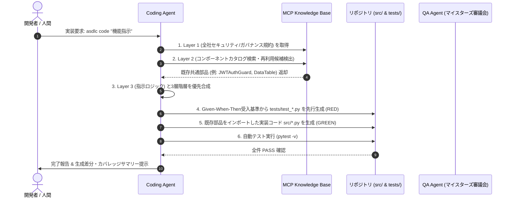

# Spec-to-Code Workflow (仕様書からコード合成への標準作業手順)

本ワークフローは、マイスターズ審議会の審査に合格した仕様書から、Coding Agent が 3層コンテキスト優先構造に基づき、テスト駆動でプロダクションコードを自動合成する標準手順（SOP）を定めたものです。

---

## 🔄 全体作業フロー図

---

## 📋 ステップ別詳細手順

### Step 1: 前提条件の確認
- 対象機能の仕様書（例: `docs/spec/detailed_design.md`）がマイスターズ審議会の `PASS` 判定を受けていること。
- `asdlc status` で現在フェーズが `Phase 4: 実装・単体テスト` であること。

### Step 2: 3層コンテキスト合成と部品照合
- 開発者が `asdlc code "<intent>"` を実行。
- Coding Agent が MCP サーバー経由でコンポーネントカタログを走査。
  - 社内に既存部品が存在する場合: 車輪の再発明を行わずインポート文を注入。
  - 存在しない場合: 新規モジュールを単一責任で設計。

### Step 3: TDD 先行テストの生成
- 仕様書の受入基準（Given-When-Then）を抽出し、`tests/test_<feature>.py` を生成。
- 実行して未実装状態（またはモック状態）で失敗（RED）することを確認。

### Step 4: 実装コード合成
- テストを満たす最小限のセキュアな実装コードを `asdlc/` または `src/` 配下に生成。
- 型ヒント（Pydantic等）および例外ハンドリングを漏れなく付与。

### Step 5: ローカル自動検証
- `pytest tests/test_<feature>.py` を実行。
- エラーが発生した場合は、Coding Agentが自己修正ループを回して全件 Green を達成。
- 開発者へコード差分とテスト成功エビデンスを提示。
