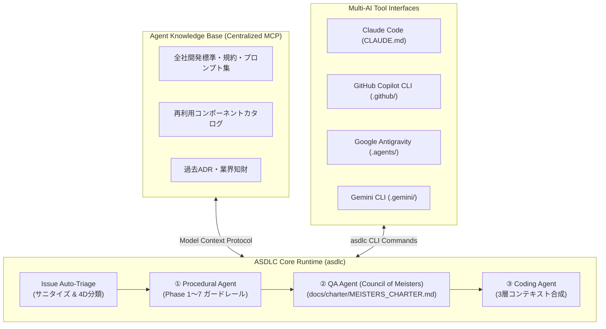

# ASDLC SDK 構想企画書 & アーキテクチャブループリント

## 1. 企画背景と解決すべき課題

### 1.1 背景：バイブコーディングの限界とエンタープライズの壁
生成AIを用いた「バイブコーディング（Vibe Coding）」は、小規模なプロトタイプ開発では劇的な工数削減（トランスコスモスの社内検証では87%削減）を達成しました。しかし、エンタープライズ規模の大規模システム開発においては、以下の構造的な壁に直面します：
1. **トップ層エンジニアへの依存**: 抽象概念と実装を自在に往復できる出現率数％のフルスタックエンジニアしか恩恵を受けられず、組織的な再現性がない。
2. **品質・セキュリティ・ガバナンスの崩壊**: 個人の「ノリ」でコードが量産され、厳格な品質基準、トレーサビリティ、コーディング規約、サプライチェーンセキュリティが担保できない。
3. **ドキュメントと仕様の乖離**: 動作するコードだけが先行し、保守運用に不可欠な設計書や仕様書が陳腐化する。

### 1.2 解決策：「ウォーターフォール × AI」による品質担保と工数削減
トランスコスモスのAI駆動開発環境「Waterfall Boost」（CodeZine掲載事例）は、アジャイルへの傾斜ではなく、品質管理の歴史を持つ**ウォーターフォールの厳格な工程を踏襲しつつ、各工程の作業時間をAIで劇的に圧縮する**アプローチを採用しました。
本SDK（`asdlc`）は、この知見をオープンソースとして再設計し、あらゆるエンタープライズ開発現場で導入可能な汎用ガバナンスSDKとして具現化します。

---

## 2. 意思決定記録 (ADR: Architecture Decision Records)

### ADR-0001: ウォーターフォールPhase 1〜7と対話型ガードレールの採用
- **文脈**: AIに任せきりにすると「人間が確認を怠ける」ため、後工程で致命的な不具合が発生する。
- **決定**: Phase 1（要件定義）からPhase 7（保守運用）までのタスク・成果物を厳格に定義し、AIからの能動的な質問への回答・確認を必須とする「Proof of Review」ガードレールを採用する。
- **帰結**: 一般層のエンジニアであっても、上流工程の抜け漏れを防ぎ、高品質な仕様書とコードを生成できる。

### ADR-0002: QA Agentの「マイスターズレビュー憲章 (docs/charter/MEISTERS_CHARTER.md)」制定
- **文脈**: 「七賢者」という固定数値やファンタジー的名称は、エンタープライズでの目的適合性や将来の拡張性に欠ける。
- **決定**: 各役割の目的が直感的に伝わる「マイスター（Meister）」シリーズへと名称を刷新（Threat Defense, Requirement Fulfillment, Pragmatic Operations, Quality Assurance, Governance Compliance, Value Proposition, Isolation Architecture）し、員数に依存しないオープンな「マイスターズ審議会（The Meisters Council）」および「マイスターズレビュー」として憲章を制定する。
- **帰結**: 評価軸の追加・カスタマイズが容易になり、100点満点ルーブリックによる厳格な品質ゲートが実現する。

### ADR-0003: 3層コンテキスト優先構造（Context Priority Hierarchy）
- **文脈**: コーディング規約を強制しすぎると開発者の自由度が奪われ、規約を無視すると品質が崩壊する。
- **決定**: `Layer 1 (全社不可侵ガバナンス)` > `Layer 2 (コンポーネントカタログ・標準)` > `Layer 3 (開発者の意図)` の3層階層構造を採用する。
- **帰結**: エンジニアに意識させることなく、既存知財の自動再利用とセキュリティ規約の遵守がシステムレベルで担保される。

### ADR-0004: 4D Issue AutoトリアージとClinejection防御
- **文脈**: 2026年最新の脅威として、Issue本文による間接プロンプトインジェクション（Clinejection）でCI/CD汚染や情報漏洩が発生している。
- **決定**: トリアージ処理の最前線にサニタイズ多層防御を配置し、Type, Priority, Component, Actionable Next Steps の4次元でIssueを自動分類・診断する。
- **帰結**: セキュアで最小権限に基づいたIssue管理の自動化を実現する。

---

## 3. システムアーキテクチャ & コンポーネント役割

