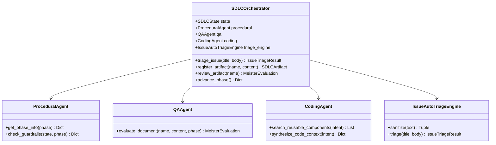

# ASDLC SDK 実装設計書

## 1. モジュール構成図



---

## 2. ディレクトリ配置

```text
v:/repos/sun.flat.yamada/ai-sdlc/
├── docs/charter/MEISTERS_CHARTER.md
├── AI_SDLC_SDK_SPECIFICATION.md
├── README.ja.md / README.md / LICENSE / Makefile / CONTRIBUTING.md
├── CLAUDE.md / .github/ / .gemini/ / .agents/
├── .devs/changes/2026-09-19_initial-asdlc-sdk/
│   ├── blueprint.md
│   ├── spec.md
│   ├── plan.md
│   ├── implementation.md
│   └── walkthrough.md
├── asdlc/
│   ├── models.py
│   ├── orchestrator.py
│   ├── triage/engine.py
│   ├── agents/ (procedural.py, qa.py, coding.py)
│   └── cli/main.py
└── tests/test_asdlc.py
```
