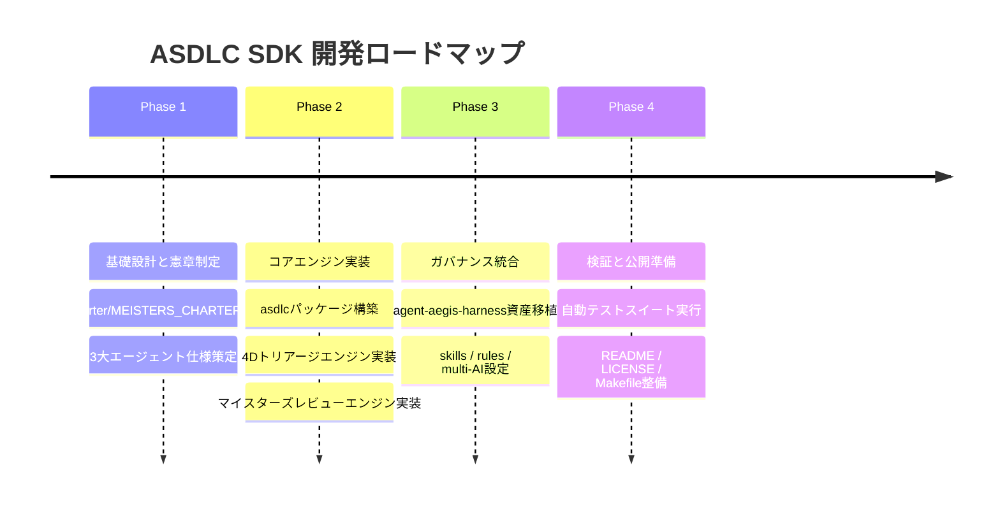

# ASDLC SDK 開発計画書 & WBS

## 1. 開発マイルストーン

---

## 2. タスク詳細 WBS

- [x] **M1: コアアーキテクチャ刷新**
  - [x] パッケージ名およびコマンド名を `asdlc` に改定
  - [x] `asdlc/models.py` にマイスターモデル・トリアージモデルを定義
  - [x] `asdlc/orchestrator.py` のライフサイクル制御実装
- [x] **M2: 4D Issue Autoトリアージの実装**
  - [x] Clinejection防御サニタイズ層の実装
  - [x] 4次元分析（Type, Priority, Component, Next Steps）
- [x] **M3: マイスターズレビュー（QA Agent: マイスターズ審議会）の実装**
  - [x] `docs/charter/MEISTERS_CHARTER.md` 憲章の策定
  - [x] 7マイスターのプロファイルと合否判定アルゴリズムの実装
- [x] **M4: ガバナンス・マルチAIツール資産の移植**
  - [x] `agent-aegis-harness` からskills/rulesを移植
  - [x] `CLAUDE.md`, `.github/copilot-instructions.md`, `.gemini/GEMINI.md` の配備
- [x] **M5: 品質検証とドキュメント整備**
  - [x] `tests/test_asdlc.py` による自動テスト（5件全パス）
  - [x] `pip install -e .` の実機動作確認
  - [x] GitHub公開用ドキュメント（README, LICENSE, CONTRIBUTING, Makefile）の整備
