# ASDLC (AI-Software-Development-Life-Cycle) SDK

**AI駆動開発 × 開発標準化を実現するエンタープライズ品質統制SDK**  
*バイブコーディングの限界を突破し、品質担保と最大51%の工数削減を両立する*

[](LICENSE)
[](https://www.python.org/)
[](#cli-usage)
[](docs/charter/MEISTERS_CHARTER.md)

[](https://buymeacoffee.com/sun.flat.yamada)

[English Version (README.md)](README.md) | [🏛️ アーキテクチャ詳解](docs/architecture/ARCHITECTURE.md) | [🧪 品質評価フレームワーク](docs/architecture/EVALUATION_FRAMEWORK.md) | [📖 実践利用ガイド](docs/guides/USAGE_GUIDE.md) | [⚖️ マイスターズレビュー憲章](docs/charter/MEISTERS_CHARTER.md) | [📋 詳細仕様書](docs/spec/AI_SDLC_SDK_SPECIFICATION.md)

---

## 🌟 概要 (Overview)

生成AIによる「バイブコーディング（Vibe Coding）」は小規模なPoCで驚異的な速度を誇る一方、エンタープライズの大規模開発では品質・セキュリティ・保守性の崩壊を招きます。

**ASDLC (`asdlc`)** は、**ウォーターフォール（厳格な工程・品質保証）× AI（各工程の作業圧縮・自律実行）** を体系化したエンタープライズ向けAI-SDLCフレームワーク＆オープンソースSDKです。

Claude Code、GitHub Copilot CLI、Google Antigravity、Gemini CLI といった主要AI CLIツールに対応し、個人依存の「ノリ」を組織的な「開発標準化」へと昇華させます。

---

## 🏛️ コアアーキテクチャ (3大エージェント + Autoトリアージ)

```mermaid
flowchart TB
    Issue["新着Issue / 不具合報告"] --> Triage["4D Autoトリアージエンジン<br>(Type / Priority / Component / Action)"]
    Triage -->|Sanitized & Classified| PA["① Procedural Agent<br>(Phase 1〜7 プロセス進行 & ガードレール)"]
    
    subgraph SDLC["ASDLC Lifecycle Engine"]
        PA -->|ドキュメント草案生成| Human["人間 (レビュー・意思決定)"]
        Human -->|"レビュー証跡 (Proof of Review)"| QA["② QA Agent (マイスターズ審議会)<br>(docs/charter/MEISTERS_CHARTER.md 準拠)"]
        QA -->|"Score >= 80 & Gate PASS"| CA["③ Coding Agent<br>(3層コンテキスト優先コード合成)"]
    end

    KB["Agent Knowledge Base (MCP Server)"] <-->|知財・規約の動的配信| SDLC
```



### 1. 4D Issue Auto-Triage（自動トリアージ & サニタイズ）
- **間接プロンプトインジェクション防御**: 2026年初頭の「Clinejection」インシデント等の脅威を分析し、Issue本文の悪意ある命令を無害化。
- **4次元分析**: 分類（Type: Bug/Feature/Security等）、優先度（Priority: P0〜P3）、推定コンポーネント、および不足情報の自動ヒアリング項目生成。

### 2. Procedural Agent（プロセス主導・ガードレール）
- **Phase 1〜7 フルライフサイクル統制**: 要件定義から本番リリース・保守運用までのタスク・成果物を管理。
- **「人間は怠ける」前提のガードレール**: 必須成果物の作成とマイスターズレビュー合格がない限り、次フェーズへの昇格を物理的にロック。
- **AIと人の明確な責務分担**: AIは草案作成・コード生成・設定自動化を担い、人間はレビュー・整合性確認・意思決定に集中。

### 3. QA Agent（マイスターズ審議会 - The Meisters Council）
- **[マイスターズレビュー憲章 (docs/charter/MEISTERS_CHARTER.md)](docs/charter/MEISTERS_CHARTER.md) 準拠**:
  1. **Threat Defense Meister**: 脅威・リスク対策（脆弱性・不確実性の脅威排除、認証・暗号化、シークレット漏洩の徹底排除）
  2. **Requirement Fulfillment Meister**: 要求仕様定義（要求の仕様化責任、完全充足、境界値・エッジケース網羅）
  3. **Pragmatic Operations Meister**: リアルな現場運用（本番運用の現実性、可観測性、ランブック具体化・曖昧領域排除）
  4. **Quality Assurance Meister**: 品質保証（受入基準 Given-When-Then、客観的テスト可能性、品質メトリクス）
  5. **Governance Compliance Meister**: 規律統制・説明責任（全社開発標準・規約準拠、ADR意思決定経緯の透明性）
  6. **Value Proposition Meister**: ビジネス価値提供（真の顧客価値創出、ROI、市場競争優位性、過剰/不足設計排除）
  7. **Isolation Architecture Meister**: Clean Architecture（疎結合性、コンポーザブル部品化、生成AI反復変更での劣化最小化）
- **可変性・拡張性**: 将来の要件に応じてマイスターを追加・再構成可能なオープン審議会設計。

### 4. Coding Agent（意識させない標準化 & コンポーザブル知財再利用）
- **3層コンテキスト優先構造**: 全社ガバナンス（Layer 1） > コンポーネントカタログ（Layer 2） > 開発者指示（Layer 3）。
- **コンポーザブルアーキテクチャ**: 社内既存部品（認証ミドルウェア、共通UI等）をMCP経由で自動検出し、車輪の再発明を自動防止。

---

---

## ⚖️ マイスターズ審議会 憲章 (The Meisters Council Charter)

本SDKの中核となる品質ゲートエンジンは、公式憲章 [MEISTERS_CHARTER.md](docs/charter/MEISTERS_CHARTER.md) に基づいて自律動作します。員数に依存しないオープン審議会として、現在以下の7名が標準配備されています。

| マイスター名称 | 役割と責任範囲 | 監視と改善の眼差し | 合格水準 |
| :--- | :--- | :--- | :--- |
| **1. Threat Defense Meister** | 脅威やリスク対策。脆弱性・不確実性の脅威残存ゼロ、認証・暗号化、シークレット漏洩の徹底排除に責任を持つ。 | 多角的なリスク対策視点で監視し、改善を導く。 | 個別 $\ge 70$ 点 |
| **2. Requirement Fulfillment Meister** | ビジネス要求・ユーザー要求の仕様定義。要求の仕様化が十分行われていることに責任を持つ。 | ビジネス・ユーザー要求の完全充足、境界値・エッジケース網羅（合理的推測）を監視し改善を導く。 | 個別 $\ge 70$ 点 |
| **3. Pragmatic Operations Meister** | リアルな現場運用。本番実運用の現実性、可観測性（ログ・監視・アラート）、ランブック具体性に責任を持つ。 | 本当に運用できるかを最重視し、具体化されていない曖昧な領域や箇所が残っていないかを監視・改善。 | 個別 $\ge 70$ 点 |
| **4. Quality Assurance Meister** | 品質保証。受入基準（Given-When-Then）、客観的テスト可能性、品質メトリクスに責任を持つ。 | 検証可能か、受入品質基準が十分に定義されているかを監視し、改善を導く。 | 個別 $\ge 70$ 点 |
| **5. Governance Compliance Meister** | 規律統制と説明責任。全社開発標準・規約準拠、ADR意思決定経緯の透明性と説明に責任を持つ。 | 意思決定材料の網羅性や説明可能になっているかを監視し、改善を導く。 | 個別 $\ge 70$ 点 |
| **6. Value Proposition Meister** | ビジネス価値提供。真の顧客価値創出、ROI、市場競争優位性、過剰/不足設計の排除に責任を持つ。 | 本当に市場で「刺さる提案」か「勝てるか」を監視し、改善を導く。 | 個別 $\ge 70$ 点 |
| **7. Isolation Architecture Meister** | 疎結合なClean Architecture。疎結合性、コンポーザブル部品化、全社コンポーネントの再利用徹底に責任を持つ。 | 生成AIによる繰り返し変更においても劣化を最小に抑えられるソフトウエア構造かを監視・改善。 | 個別 $\ge 70$ 点 |

> **品質ゲート判定基準**:  
> 全マイスターの加重平均スコア $\ge 80.0$ 点 かつ 全マイスター個別スコア $\ge 70.0$ 点で `PASS`。未達時は具体的改善指示を発行しフェーズ昇格をロック。

## 🚀 クイックスタート (Installation & Usage)

### インストール
```bash
git clone https://github.com/sun-flat-yamada/asdlc.git
cd asdlc
pip install -e .
```

### コマンドライン操作 (`asdlc`)

```bash
# 1. パイプライン状態とガードレールの確認
asdlc status

# 2. Issue の 4次元自動トリアージ
asdlc triage "JWT認証の有効期限切れ時に500エラーが発生する"

# 3. 成果物のマイスターズレビュー（マイスターズ審議会審査）
asdlc review requirements.md

# 4. ガードレールを通過して次フェーズへ昇格
asdlc advance

# 5. 3層コンテキストによる標準化コードの合成
asdlc code "ユーザー一覧テーブルとJWT認証APIを作成したい"
```

---

## 🤖 マルチAI CLIツール対応 (Multi-Tool Compatibility)

本リポジトリは、開発者が愛用する主要AIツールにシームレスに適合します。

| AI ツール | 設定ファイル | 連携仕様 |
| :--- | :--- | :--- |
| **Claude Code** | `CLAUDE.md` | スラッシュコマンド（`/status`, `/triage`, `/review`, `/code`）およびルール自動参照 |
| **GitHub Copilot CLI** | `.github/copilot-instructions.md` | Copilot CLI が参照するフェーズ統制・3層コンテキスト規約 |
| **Google Antigravity** | `.agents/rules/` & `.agents/skills/` | Two-Phase Governance および ドキュメント駆動ライフサイクルの完全統合 |
| **Gemini CLI** | `.gemini/GEMINI.md` | Gemini CLI 用システムインストラクション |

---

## 📊 開発現場における「10の構造変化」

AI駆動開発の本格導入に伴い、ソフトウェア開発の現場では次のような本質的な「10の構造変化」が生じます。本SDKはこれらをアーキテクチャレベルで支援・担保する設計となっています。

1. 人の役割が「書く」から「レビュー・意思決定・方向づけ」に
2. 成果物の主役が「ソースコード」から「意図・仕様」に
3. テスト・検証が「後工程」から「前提条件」に
4. 保守運用の自動化が前提となる
5. 開発ドキュメントが必ず生成される
6. 開発標準化、コンポーザブルアーキテクチャが実現
7. ガバナンス・セキュリティが「組み込み前提」に
8. 属人性が低下
9. 試行錯誤コストが下がり、開発文化が「探索的」に
10. 参加者の裾野が広がり、システム開発が民主化

---

## 🗂️ エコシステム・構成一覧 (Ecosystem & Architecture Index)

| 分類 | ファイル / パス | 役割と概要 |
| :--- | :--- | :--- |
| **ドキュメント** | [`docs/architecture/ARCHITECTURE.md`](docs/architecture/ARCHITECTURE.md) | システムアーキテクチャ詳解、数理ゲートモデル、状態遷移 |
| | [`docs/guides/USAGE_GUIDE.md`](docs/guides/USAGE_GUIDE.md) | 実践チュートリアル、CLIリファレンス、ツール連携 |
| | [`docs/charter/MEISTERS_CHARTER.md`](docs/charter/MEISTERS_CHARTER.md) | マイスターズレビュー公式憲章（7賢者ルーブリック） |
| | [`docs/spec/AI_SDLC_SDK_SPECIFICATION.md`](docs/spec/AI_SDLC_SDK_SPECIFICATION.md) | SDK機能仕様書、6ペルソナ協議議事録 |
| **エージェント** | [`.agents/agents/coding_agent.md`](.agents/agents/coding_agent.md) | 3層コンテキスト優先コード合成 & TDDエージェント |
| | [`.agents/agents/qa_meisters_agent.md`](.agents/agents/qa_meisters_agent.md) | マイスターズ審議会（The Meisters Council）審査エージェント |
| | [`.agents/agents/procedural_agent.md`](.agents/agents/procedural_agent.md) | Waterfall 7工程制御 & Proof of Review 進行エージェント |
| **スキル** | [`.agents/skills/asdlc-coding-agent/`](.agents/skills/asdlc-coding-agent/SKILL.md) | 3層コンテキスト標準化コード合成スキル |
| | [`.agents/skills/asdlc-composable-catalog/`](.agents/skills/asdlc-composable-catalog/SKILL.md) | MCP経由の社内コンポーネントカタログ検索・再利用スキル |
| | [`.agents/skills/asdlc-tdd-synthesis/`](.agents/skills/asdlc-tdd-synthesis/SKILL.md) | Given-When-Then受入基準からのテスト自動生成スキル |
| | [`.agents/skills/asdlc-meisters-review/`](.agents/skills/asdlc-meisters-review/SKILL.md) | 7マイスターによる100点満点ルーブリック審査スキル |
| | [`.agents/skills/asdlc-remediation-loop/`](.agents/skills/asdlc-remediation-loop/SKILL.md) | FAIL判定時の是正タスク（Remediation Backlog）自動生成スキル |
| | [`.agents/skills/asdlc-quality-gatekeeper/`](.agents/skills/asdlc-quality-gatekeeper/SKILL.md) | 成果物・レビュー・人間署名を検証するゲートキープスキル |
| | [`.agents/skills/asdlc-issue-triage/`](.agents/skills/asdlc-issue-triage/SKILL.md) | Clinejection防御付き 4D Issue 自動トリアージスキル |
| **規約・ルール** | [`.agents/rules/asdlc-coding-rules.md`](.agents/rules/asdlc-coding-rules.md) | コーディング規約（不可侵ガバナンス・TDD義務・再発明防止） |
| | [`.agents/rules/asdlc-qa-rules.md`](.agents/rules/asdlc-qa-rules.md) | 審査規約（加重平均80点・最低70点基準・具体的改善義務） |
| | [`.agents/rules/asdlc-lifecycle-rules.md`](.agents/rules/asdlc-lifecycle-rules.md) | 5段階ライフサイクルおよび無断コード変更の禁止規約 |
| **ワークフロー** | [`.agents/workflows/spec_to_code_workflow.md`](.agents/workflows/spec_to_code_workflow.md) | 仕様書からTDD・コード合成に至る標準作業手順（SOP） |
| | [`.agents/workflows/qa_gate_workflow.md`](.agents/workflows/qa_gate_workflow.md) | マイスターズ審議会 審査・判定・是正の標準手順（SOP） |
| | [`.agents/workflows/full_lifecycle_workflow.md`](.agents/workflows/full_lifecycle_workflow.md) | Issue着信からPhase 7運用に至るエンドツーエンド手順（SOP） |
| | [`.github/workflows/asdlc-issue-triage.yml`](.github/workflows/asdlc-issue-triage.yml) | GitHub Actions: 新着Issue自動4Dトリアージ |
| | [`.github/workflows/asdlc-qa-gate.yml`](.github/workflows/asdlc-qa-gate.yml) | GitHub Actions: PR時マイスターズレビュー自動審査 |

---

## 🤝 Contribution & Support

Contributions are welcome! If you find this tool useful, please consider supporting its development.

[](https://buymeacoffee.com/sun.flat.yamada)

---

## 📚 参考文献 (References)

1. **エンタープライズAI-SDLC・開発標準化の実践事例**:
   - ウォーターフォール型品質管理とAI作業圧縮を両立させた産業界の検証事例（例: トランスコスモス「Waterfall Boost」CodeZine掲載事例など）
2. **Model Context Protocol (MCP)**: [Anthropic MCP 公式仕様](https://modelcontextprotocol.io/)
3. **仕様駆動開発（Spec-Driven Development）**: IEEE ソフトウェアエンジニアリング標準およびアジャイル・ウォーターフォール融合モデル

---

## 📄 ライセンス

MIT License - Copyright (c) 2026 @sun-flat-yamada (Youhei Yamada)
