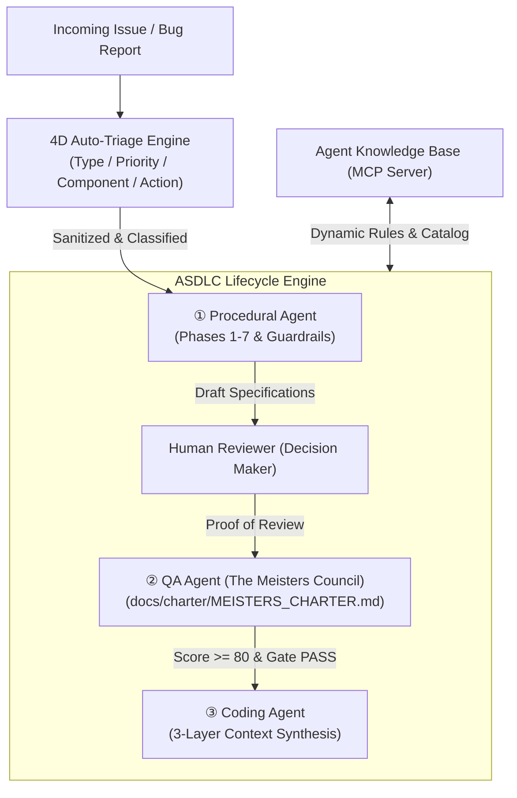

# ASDLC (AI-Software-Development-Life-Cycle) SDK

**Enterprise AI Development Standardization & Governance SDK**  
*Overcoming the limits of Vibe Coding with guaranteed quality and up to 51% labor reduction.*

[](LICENSE)
[](https://www.python.org/)
[](#cli-usage)
[](docs/charter/MEISTERS_CHARTER.md)

[](https://buymeacoffee.com/sun.flat.yamada)

[日本語版 (README.ja.md)](README.ja.md) | [🏛️ System Architecture](docs/architecture/ARCHITECTURE.md) | [🧪 Quality Evaluation Framework](docs/architecture/EVALUATION_FRAMEWORK.md) | [📖 Usage Guide](docs/guides/USAGE_GUIDE.md) | [⚖️ The Meisters Charter](docs/charter/MEISTERS_CHARTER.md) | [📋 Full Specification](docs/spec/AI_SDLC_SDK_SPECIFICATION.md)

---

## 🌟 Overview

While "Vibe Coding" with Generative AI offers rapid prototyping, it often fails in enterprise environments due to a lack of governance, security, and document-code synchronization.

**ASDLC (`asdlc`)** is an enterprise-grade AI-Software Development Life Cycle (AI-SDLC) framework and SDK. It marries the rigorous quality gates of traditional Waterfall development with the high velocity and automation of agentic AI.

Designed to seamlessly integrate with **Claude Code, GitHub Copilot CLI, Google Antigravity, and Gemini CLI**, ASDLC transforms individual AI experiments into organization-wide software engineering standardization.

---

## 🏛️ Core Architecture



### Key Pillars
1. **4D Issue Auto-Triage**: Indirect prompt injection sanitization (mitigating 2026 "Clinejection" vectors), 4-dimensional classification, and missing info templates.
2. **Procedural Agent**: Full Waterfall lifecycle (Phase 1 to Phase 7) with guardrails preventing humans from bypassing required reviews.
3. **QA Agent (The Meisters Council)**: Evaluates artifacts under the [Meisters Review Charter](docs/charter/MEISTERS_CHARTER.md) across 7 specialized defense areas (Threat Defense, Requirement Fulfillment, Pragmatic Operations, Quality Assurance, Governance Compliance, Value Proposition, Isolation Architecture).
4. **Coding Agent**: Enforces 3-layer context hierarchy (Governance > Catalog > Prompt) to ensure reusable, composable architecture.

---

---

## ⚖️ The Meisters Council Charter (Quality Gate)

The core QA Gate operates under the official charter: [MEISTERS_CHARTER.md](docs/charter/MEISTERS_CHARTER.md). The Meisters Council functions as an extensible body, featuring 7 standard defense pillars:

| Meister Name | Mission & Review Focus | Min Score |
| :--- | :--- | :--- |
| **1. Threat Defense Meister** | Threat defense, security bounds, encryption, and secret leak prevention | $\ge 70$ pts |
| **2. Requirement Fulfillment Meister** | Full requirement fulfillment, edge cases, and explicit scope | $\ge 70$ pts |
| **3. Pragmatic Operations Meister** | Real-world operational feasibility, observability, and runbook readiness | $\ge 70$ pts |
| **4. Quality Assurance Meister** | Acceptance criteria (Given-When-Then), verifiable testability | $\ge 70$ pts |
| **5. Governance Compliance Meister** | Enterprise governance, ADR rationale transparency, and auditability | $\ge 70$ pts |
| **6. Value Proposition Meister** | True customer value, ROI, competitive edge, anti-overengineering | $\ge 70$ pts |
| **7. Isolation Architecture Meister** | Loose coupling, modular composability, and component reuse | $\ge 70$ pts |

> **Gate Criteria**: Weighted average score $\ge 80.0$ AND every meister score $\ge 70.0$ for `PASS`.

## 🚀 CLI Usage (`asdlc`)

```bash
# Check current phase and guardrails
asdlc status

# 4D issue auto-triage
asdlc triage "500 Internal Server Error when JWT token expires"

# Execute Meisters Review (against The Meisters Council)
asdlc review requirements.md

# Advance to next phase after clearing guardrails
asdlc advance

# Synthesize standardized code
asdlc code "Build user data table with JWT authentication middleware"
```

---

## 🤖 Multi-AI Tool Support

| Tool | Config File | Purpose |
| :--- | :--- | :--- |
| **Claude Code** | `CLAUDE.md` | Slash commands (`/status`, `/triage`, `/review`, `/code`) and governance rules |
| **GitHub Copilot CLI** | `.github/copilot-instructions.md` | Phase progression and 3-layer context compliance |
| **Google Antigravity** | `.agents/rules/` & `.agents/skills/` | Two-Phase Governance & document lifecycle skills |
| **Gemini CLI** | `.gemini/GEMINI.md` | System instructions for Gemini CLI |

---

## 🗂️ Ecosystem & Architecture Index

| Category | File / Path | Purpose & Description |
| :--- | :--- | :--- |
| **Documentation** | [`docs/architecture/ARCHITECTURE.md`](docs/architecture/ARCHITECTURE.md) | In-depth system architecture, gate formulas, and state transitions |
| | [`docs/guides/USAGE_GUIDE.md`](docs/guides/USAGE_GUIDE.md) | Step-by-step practical usage tutorial, CLI reference, and tool pairing |
| | [`docs/charter/MEISTERS_CHARTER.md`](docs/charter/MEISTERS_CHARTER.md) | The Meisters Review Charter (7 Meisters rubrics & gate thresholds) |
| | [`docs/spec/AI_SDLC_SDK_SPECIFICATION.md`](docs/spec/AI_SDLC_SDK_SPECIFICATION.md) | Full technical specification and 6-persona consensus notes |
| **Agents** | [`.agents/agents/coding_agent.md`](.agents/agents/coding_agent.md) | 3-Layer context synthesis & TDD coding agent persona |
| | [`.agents/agents/qa_meisters_agent.md`](.agents/agents/qa_meisters_agent.md) | The Meisters Council QA agent persona |
| | [`.agents/agents/procedural_agent.md`](.agents/agents/procedural_agent.md) | Waterfall Phases 1-7 & Proof-of-Review procedural agent persona |
| **Skills** | [`.agents/skills/asdlc-coding-agent/`](.agents/skills/asdlc-coding-agent/SKILL.md) | Standardized code synthesis skill |
| | [`.agents/skills/asdlc-composable-catalog/`](.agents/skills/asdlc-composable-catalog/SKILL.md) | Reusable enterprise component lookup skill via MCP |
| | [`.agents/skills/asdlc-tdd-synthesis/`](.agents/skills/asdlc-tdd-synthesis/SKILL.md) | Acceptance criteria to automated test generation skill |
| | [`.agents/skills/asdlc-meisters-review/`](.agents/skills/asdlc-meisters-review/SKILL.md) | 100-point rubric evaluation skill by The Meisters Council |
| | [`.agents/skills/asdlc-remediation-loop/`](.agents/skills/asdlc-remediation-loop/SKILL.md) | Automated remediation backlog and patch generation skill |
| | [`.agents/skills/asdlc-quality-gatekeeper/`](.agents/skills/asdlc-quality-gatekeeper/SKILL.md) | Phase advancement and Proof-of-Review gatekeeper skill |
| | [`.agents/skills/asdlc-issue-triage/`](.agents/skills/asdlc-issue-triage/SKILL.md) | 4D issue auto-triage with prompt injection defense skill |
| **Rules** | [`.agents/rules/asdlc-coding-rules.md`](.agents/rules/asdlc-coding-rules.md) | Coding governance rules (3-layer context, TDD, anti-reinvention) |
| | [`.agents/rules/asdlc-qa-rules.md`](.agents/rules/asdlc-qa-rules.md) | Quality gate rules (Score $\ge 80$, Min $\ge 70$, actionable fixes) |
| | [`.agents/rules/asdlc-lifecycle-rules.md`](.agents/rules/asdlc-lifecycle-rules.md) | Document-driven development & lifecycle transition rules |
| **Workflows** | [`.agents/workflows/spec_to_code_workflow.md`](.agents/workflows/spec_to_code_workflow.md) | Spec-to-Code and TDD execution SOP |
| | [`.agents/workflows/qa_gate_workflow.md`](.agents/workflows/qa_gate_workflow.md) | Meisters Review, verdict, and remediation SOP |
| | [`.agents/workflows/full_lifecycle_workflow.md`](.agents/workflows/full_lifecycle_workflow.md) | End-to-end SDLC operational workflow SOP |
| | [`.github/workflows/asdlc-issue-triage.yml`](.github/workflows/asdlc-issue-triage.yml) | GitHub Actions: automated 4D issue triage on issue open |
| | [`.github/workflows/asdlc-qa-gate.yml`](.github/workflows/asdlc-qa-gate.yml) | GitHub Actions: automated Meisters Review on PR |

---

## 🤝 Contribution & Support

Contributions are welcome! If you find this tool useful, please consider supporting its development.

[](https://buymeacoffee.com/sun.flat.yamada)

---

## 📚 References

1. **Enterprise AI-SDLC & Standardization Case Studies**:
   - Industry empirical studies on combining waterfall quality gates with AI acceleration (e.g., transcosmos "Waterfall Boost" case study on CodeZine).
2. **Model Context Protocol (MCP)**: [Anthropic MCP Specification](https://modelcontextprotocol.io/)
3. **Spec-Driven & Document-Driven Development**: IEEE Software Engineering Standards & Agile-Waterfall Hybrid Practices.

---

## 📄 License

MIT License - Copyright (c) 2026 @sun-flat-yamada (Youhei Yamada)
