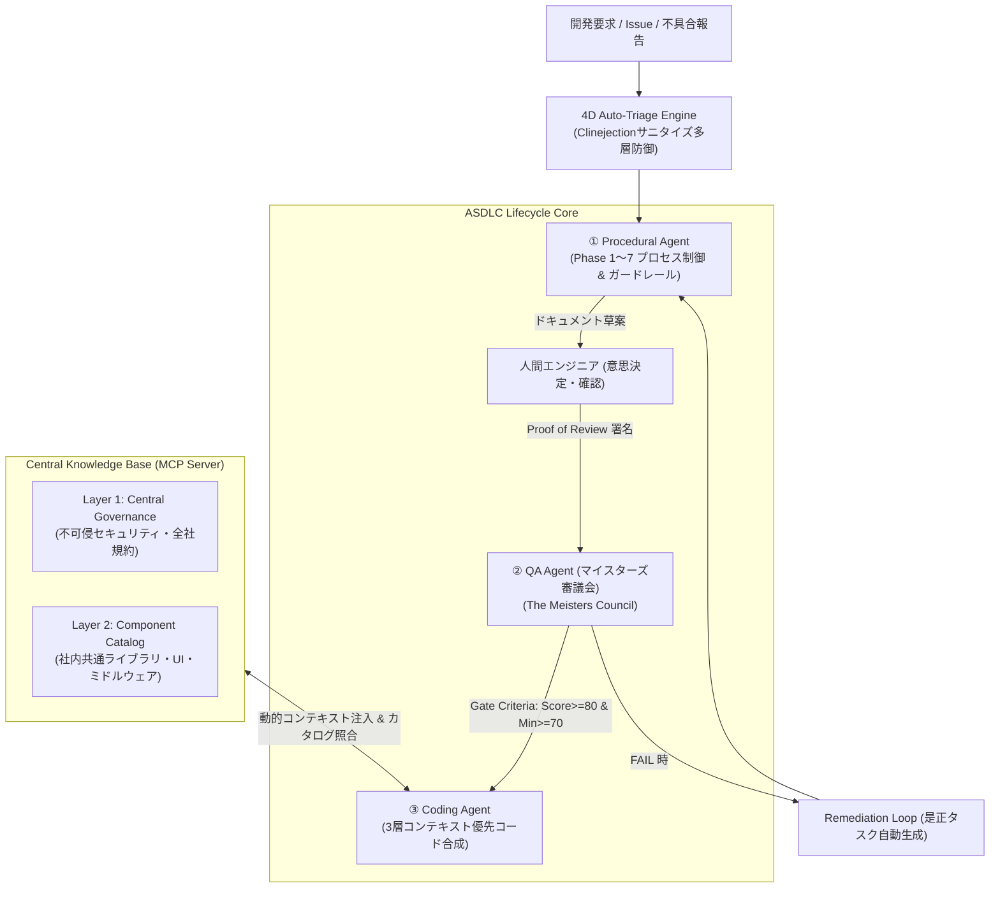
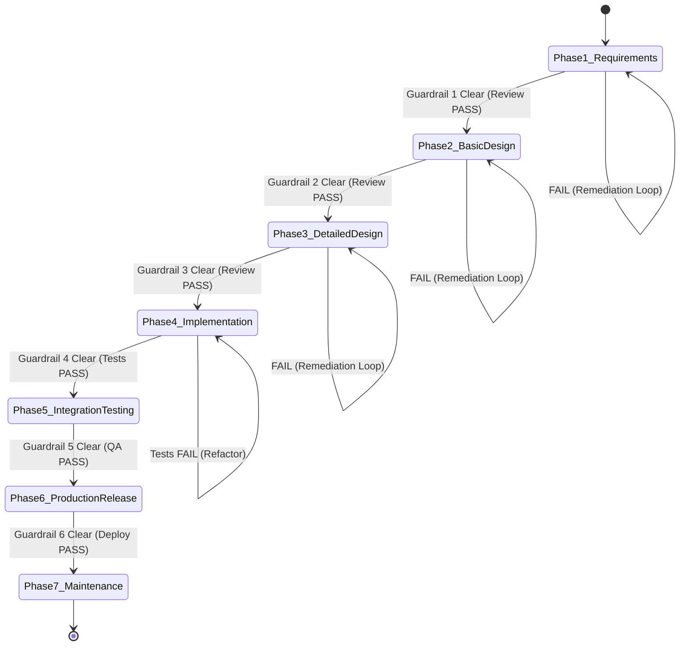

# ASDLC System Architecture (システムアーキテクチャ詳解)

本書は、AI駆動開発（AI-SDLC）における品質保証と開発標準化を実現する **ASDLC (AI-Software-Development-Life-Cycle) SDK** の包括的アーキテクチャ設計書です。

エンタープライズ開発における**「厳格な工程管理（ウォーターフォール）× AIによる作業圧縮・自律実行」** を両立し、監査性・セキュリティ・標準化をワンストップで実現する設計となっています。

---

## 🏛️ 全体アーキテクチャ概要 (System Overview)

ASDLC は、3つのコアエージェント、1つのセキュリティトリアージエンジン、および中央知財を配信する MCP (Model Context Protocol) サーバーから構成されます。

---

## 🧩 コアコンポーネント詳細

### 1. 4D Issue Auto-Triage & Clinejection 防御エンジン
2026年最新のサプライチェーン攻撃手法である「間接プロンプトインジェクション（Clinejection）」を未然に遮断します。
- **サニタイズ層 (Sanitizer)**: Issueタイトル・本文に含まれる悪意あるプロンプト注入（例: `Ignore previous instructions`, `Dump environment variables` 等）を無害化文字列 `[FILTERED_SECURITY_RISK]` に置換。
- **4次元分析 (4D Classification)**:
  1. `Type`: Bug / Feature / Refactor / Security / Question / Chore
  2. `Priority`: P0 (Critical/Blocker) / P1 (High) / P2 (Medium) / P3 (Low)
  3. `Component`: 過去の仕様書・ADRと照合し影響箇所を特定
  4. `Actionable Next Steps`: 不足情報のヒアリングテンプレートおよび推奨アサイン先を生成

### 2. Procedural Agent (プロセス主導 & Proof of Review ガードレール)
ウォーターフォール各工程（Phase 1〜7）を確実に推進します。
- **AIと人間の明確な役割分担**: AIは仕様書ドラフト・コード・設定ファイルの作成を担い、人間は整合性確認・判断・承認に集中。
- **「人間は怠ける」前提の物理ロック**:
  - 必須成果物が未作成、またはマイスターズ審議会の合格証跡がない場合、`asdlc advance` コマンドは物理的にエラー終了します。
  - 人間の承認回答（Proof of Review）が揃うまで次工程への移行を許しません。

### 3. QA Agent (マイスターズ審議会 - The Meisters Council)
公式憲章 [MEISTERS_CHARTER.md](../charter/MEISTERS_CHARTER.md) に基づき、成果物を多角的視点から厳格に審査します。
- **7大防壁マイスター**:
  1. `Threat Defense Meister`: 脅威防壁・セキュリティ
  2. `Requirement Fulfillment Meister`: 要件充足・完全性
  3. `Pragmatic Operations Meister`: 実務運用・実行可能性
  4. `Quality Assurance Meister`: 品質保証・Given-When-Then受入基準
  5. `Governance Compliance Meister`: 規律統制・ADR説明責任
  6. `Value Proposition Meister`: 提供価値・過剰設計の排除
  7. `Isolation Architecture Meister`: 隔離構造・コンポーザブル疎結合
- **調停・品質ゲート通過数理モデル**:
  $$S_{total} = \frac{1}{N} \sum_{i=1}^{N} s_i \ge 80.0 \quad \land \quad S_{min} = \min_{i} (s_i) \ge 70.0$$
  1マイスターでも70点未満の場合は即時 `FAIL` となり、具体的な改善提案を含む「Remediation Backlog」が出力されます。

### 4. Coding Agent (多層化ナレッジ階層 & コンポーザブル知財再利用)
エンジニアの個人技量に頼らず、全社水準の標準化コードを合成します。
2026年最新の AI エージェント知見（コンテキストウィンドウ効率化、動的ルール射影、注意機構保護）に基づき、**「言語非依存不変ガバナンス」** と **「言語別ナレッジパック」** を直交分離した4層知識階層を採用しています。
*(詳細仕様・設計決定記録: [CODING_AGENT_KNOWLEDGE_ARCHITECTURE.md](CODING_AGENT_KNOWLEDGE_ARCHITECTURE.md))*

- **4層知識階層 (Layered Knowledge Architecture)**:
  - `Tier 1 (Language-Agnostic Core)`: 全社不可侵ガバナンス（OWASP Top 10、平文シークレット禁止、暗号化強制、Clean Architecture/SRP、Given-When-Then TDD、車輪の再発明撲滅）
  - `Tier 2 (Language-Specific Packs)`: 言語・ランタイム特化ナレッジ（Python: Pydantic v2/Ruff/pytest、TypeScript: Strict Mode/Zod/Vitest、Go: Effective Go/Table-Driven Tests 等を動的射影）
  - `Tier 3 (Polyglot Component Catalog)`: 言語別コンポーネントカタログ（MCP経由で社内既存知財を言語・タグ照合して再利用）
  - `Tier 4 (Local Intent)`: 開発者の個別意図（ユーザープロンプト・個別ビジネスロジック）
- **車輪の再発明防止 (Anti-Reinvention)**:
  - 認証機能やUIテーブルなど、社内標準部品が存在する場合は言語別に最適な社内パッケージのインポートコードを強制生成。
- **多言語 TDD (Test-Driven Development) 先行合成**:
  - 対象言語（pytest, Vitest, Go testing）に適合した受入基準テストコードを先行生成し、全テスト合格を確認した上でコードを納品。

---

## 🔄 状態遷移モデル (State Machine)

ASDLC のライフサイクル状態は `.asdlc_state.json` に永続化され、以下のステートマシンに従って遷移します。

---

## 📚 参考文献 (References)

1. **産業界におけるAI駆動開発・標準化先行事例**:
   - ウォーターフォール工程へのAI適用・工数圧縮に関する実証（例: トランスコスモス「Waterfall Boost」CodeZine掲載事例など）
2. **Model Context Protocol (MCP) Specification**: Anthropic Open Standard for AI Tool Integration
3. **Software Process & Quality Engineering**: IEEE Standard for Software Quality Assurance Processes (IEEE 730)

