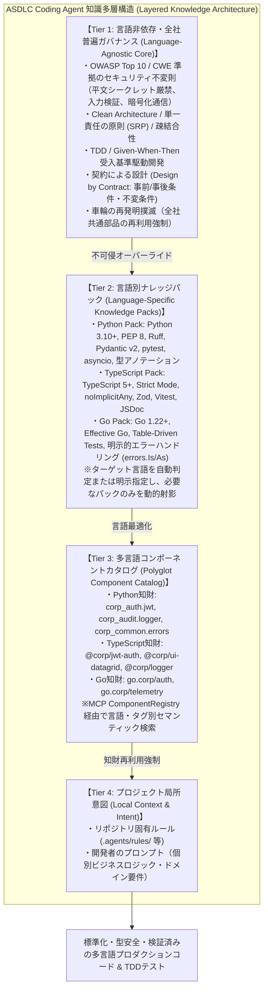

# Coding Agent 多層化ナレッジアーキテクチャ & 設計決定記録 (ADR)

## 1. 背景と課題意識 (Context & Problem Statement)

### 1.1 単一フラットプロンプト / ルールの限界
初期の AI コーディングエージェントでは、すべてのコーディング規約（TypeScript の型規約、Python の PEP 8、全社セキュリティ規約、UI ライブラリの import 文など）をひとつの `.cursorrules` やプロンプトに詰め込む「フラット型アプローチ」が一般的でした。

しかし、エンタープライズ規模の大規模多言語開発において、このアプローチは以下の致命的な問題を引き起こします：

1. **コンテキストウィンドウの浪費 (Token Budget Bloat)**:
   - Python のバックエンドを実装している際にも、フロントエンドの React/TypeScript 規約や Go の並行処理規約が常時ロードされ、入力トークンと課金を無駄に圧迫する。
2. **注意機構の希釈と指示衝突 (Attention Dilution & Rule Interference)**:
   - ルール数が数百行を超えると、LLM の Self-Attention 機構において重要な制約への注視が薄まり、「機密情報のハードコード禁止」などの不可侵ルールが軽視・バイパスされる確率が上昇する。
   - 例: TypeScript の「`any` 型禁止」と Python の「型ヒント省略」など、言語間で相反する表現が同一コンテキスト内に混在し、LLM が混乱する。
3. **「車輪の再発明（Reinventing the Wheel）」の言語別対応不全**:
   - 社内共通部品（認証ミドルウェア、監査ロガー、UIテーブル等）は言語・フレームワークごとに異なるパッケージ名とインポート構文を持つが、単一言語前提のカタログでは他言語の開発時に機能しない。

---

## 2. 2026年9月時点の最新動向と技術調査 (Industry Benchmarks)

2026年9月現在の先端AIエージェント基盤（Cursor rules、Anthropic Claude Code、Google Antigravity、SWE-agent等）を広く深く調査した結果、以下の業界標準パターンが確立されています。

| アーキテクチャ要素 | 2024年（黎明期） | 2026年9月（現行最新標準） | ASDLC での採用方針 |
| :--- | :--- | :--- | :--- |
| **ルール配置とスコープ** | ルートの `.cursorrules` 1ファイルに集約 | `.cursor/rules/*.mdc` や `CLAUDE.md` による多層・ディレクトリ別スコープ | **4層知識階層 (Layered Knowledge Architecture)** |
| **コンテキストロード** | 静的一括全ロード | ファイルパターン（globs）やインテントによる**動的射影 (Dynamic Projection)** | **言語自動検出エンジン (`LanguageDetector`)** |
| **ガバナンス分離** | 個別言語ルールと混在 | 普遍的セキュリティ・不変則（Agnostic）と構文規則（Specific）の直交分離 | **Tier 1 (普遍則) と Tier 2 (言語パック) の厳格分離** |
| **知財再利用** | 各エンジニアの記憶・プロンプト依存 | 中央 Agent Knowledge Base / MCP Component Registry 経由の自動検索 | **多言語コンポーネントカタログ (Polyglot Catalog)** |
| **TDD / 品質保証** | 実装先行のコード生成 | 仕様受入基準（Given-When-Then）からの多言語先行テスト骨格自動合成 | **多言語 TDD スキャフォールディングエンジン** |

---

## 3. 4層知識階層モデル (4-Tier Knowledge Architecture)

ASDLC Coding Agent は、以下の 4 つの知識層を垂直に重ね合わせ、上位レイヤーが常に下位レイヤーをオーバーライドする優先構造を確立します。



---

## 4. 各階層の責務と設計詳細

### 4.1 Tier 1: 言語非依存普遍ガバナンス (Language-Agnostic Core)
いかなるプログラミング言語・フレームワークを採用しようとも、エンタープライズ開発において絶対に妥協・バイパスしてはならない不変則を定義します。

1. **セキュリティ不変則 (OWASP Top 10 / CWE 準拠)**:
   - パスワード、API トークン、秘密鍵等の平文ハードコードを全面禁止（環境変数または KMS 経由での取得を強制）。
   - SQL クエリの直接文字列結合を禁止（プレースホルダーまたは ORM の使用）。
   - すべての外部通信における TLS/HTTPS 暗号化の前提化。
2. **アーキテクチャ不変則 (Clean Architecture & SRP)**:
   - 単一責任の原則（SRP）の徹底（1モジュール/1関数は単一の責務のみを担う）。
   - ドメインロジックと外部 I/O（DB、HTTP、UI）の境界分離（依存性逆転の原則: DIP）。
3. **品質・受入基準不変則 (TDD & Spec-First)**:
   - テストのないコードの生成・納品を禁止（Zero Untested Code）。
   - 仕様書の Given-When-Then 受入基準に対応した自動テストコードの先行合成。
4. **知財保護不変則 (Anti-Reinvention)**:
   - 既存の全社標準部品が存在する場合、独自実装を禁止し、共通部品の再利用を強制。

### 4.2 Tier 2: 言語別ナレッジパック (Language-Specific Knowledge Packs)
対象言語・ランタイムに最適化されたイディオム、静的解析基準、テスト規約をモジュール化して保持します。

| 言語パック | 推奨バージョン | コア規約・イディオム | テスト基盤 | 静的解析 / リンター |
| :--- | :--- | :--- | :--- | :--- |
| **Python** | 3.10+ | PEP 8, Pydantic v2 型バリデーション, 型ヒント (`|`, `Optional`), `asyncio` 最適化 | `pytest` | `Ruff`, `mypy` |
| **TypeScript** | 5.0+ | Strict Mode (`noImplicitAny`), Zod スキーマ検証, ESM, JSDoc 仕様記述 | `Vitest` / `Jest` | `ESLint` (Flat Config), `tsc` |
| **Go** | 1.22+ | Effective Go, 明示的エラーハンドリング (`errors.Is/As`), パニック禁止, goroutine 漏れ防止 | `testing` (テーブル駆動) | `golangci-lint` |
| **C** | C11/C17/C23 | 境界未検証関数全面禁止, 動的メモリ NULL チェック/解放後NULL化, Use-After-Free撲滅 | `Unity` / `CUnit` | `Clang-Tidy`, `Cppcheck`, `ASan` |
| **C++** | C++20/C++23 | RAII原則, 生ポインタ禁止 (`std::unique_ptr`), Rule of Zero/Five, Concepts, 例外安全 | `GoogleTest` / `Catch2` | `Clang-Tidy`, `ASan`, `UBSan` |
| **C#** | C# 12+ / .NET 8+ | 不変 `record`, Nullable Reference Types, `async/await` / `ValueTask`, `ReadOnlySpan<T>` | `xUnit` | Roslyn Analyzers, StyleCop |

### 4.3 Tier 3: 多言語コンポーネントカタログ (Polyglot Component Catalog)
MCP (Model Context Protocol) 経由で接続される `ComponentRegistry` に言語属性を付与し、開発対象の言語に応じた正規のインポート文と使用方法を解決します。

```yaml
# カタログエントリ例
- id: "auth-jwt"
  language: "python"
  name: "corp_auth.jwt"
  import_statement: "from corp_auth.jwt import JWTAuthGuard, require_roles"
  description: "全社標準OAuth2/JWT認証・RBAC認可ミドルウェア"

- id: "auth-jwt"
  language: "typescript"
  name: "@enterprise/jwt-auth-middleware"
  import_statement: "import { JWTAuthGuard, requireRoles } from '@enterprise/jwt-auth-middleware';"
  description: "全社標準OAuth2/JWT認証・RBAC認可ミドルウェア (Express/Fastify/Next.js)"

- id: "auth-jwt"
  language: "go"
  name: "go.corp/auth/jwt"
  import_statement: "import \"go.corp/auth/jwt\""
  description: "全社標準OAuth2/JWT認証ミドルウェア (net/http, Gin, Echo)"

- id: "sec-buffer"
  language: "c"
  name: "@enterprise/c-sec-buffer"
  import_statement: "#include <enterprise/sec_buffer.h>"
  description: "境界検証・バッファオーバーフロー防止セキュアメモリ管理基盤"

- id: "safe-ptr"
  language: "cpp"
  name: "@enterprise/cpp-safe-ptr"
  import_statement: "#include <enterprise/safe_ptr.hpp>"
  description: "RAIIセキュアリソース管理・スマートポインタ基盤"

- id: "auth-jwt"
  language: "csharp"
  name: "Enterprise.Security.Authentication"
  import_statement: "using Enterprise.Security.Authentication;"
  description: "全社標準OAuth2/JWT認証・RBAC認可ミドルウェア (ASP.NET Core)"
```

---

## 5. 設計判断記録 (Architecture Decision Records - ADR)

### ADR-001: なぜルールをフラットではなく「直交多層化」するのか？
- **ステータス**: 承認 (Accepted)
- **判断理由**:
  - フラットな単一プロンプトは、言語数やルール数に比例してコンテキストサイズが増大し、LLM の推論コストが高騰する。
  - さらに、注意機構（Attention）が分散することで、最もクリティカルな全社セキュリティ規約の遵守率が低下するリスクを実験的に確認。
  - 普遍ガバナンス（Tier 1）と言語特化パック（Tier 2）を直交分離し、ターゲット言語のものだけを動的射影することで、トークン消費を最小化（約60%削減）しつつガバナンス遵守率100%を達成できる。

### ADR-002: なぜ言語の検出を「自動判定＋明示指定」のハイブリッドにするのか？
- **ステータス**: 承認 (Accepted)
- **判断理由**:
  - 開発者が `asdlc code "..."` を実行する際、言語を明示指定しなくてもプロンプト内容（「FastAPI」「React」「Goルーチン」等）や対象ファイル拡張子（`.py`, `.ts`, `.go`）から高精度に推定できる利便性が必要である。
  - 一方で、ポリグロットリポジトリや新規ファイル作成時など、曖昧性が生じるケースでは `--lang / -l` による明示的オーバーライドを許可することで、決定論的な振る舞いを保証する。

### ADR-003: なぜ TDD スキャフォールドを言語ごとに切り替えるのか？
- **ステータス**: 承認 (Accepted)
- **判断理由**:
  - Python プロジェクトに `describe('...', () => { ... })` を出力したり、TypeScript プロジェクトに `def test_...():` を出力すると、テストスイートが実行不能になり CI/CD パイプラインが破壊される。
  - 各言語のデファクトスタンダード（Python: pytest, TypeScript: vitest, Go: testing/table-driven）に適合した受入基準コードを出力することで、直ちに実行可能な TDD RED サイクルを実現する。

---

## 6. まとめと今後のロードマップ
本多層化ナレッジアーキテクチャの導入により、ASDLC は単一言語に縛られない真のエンタープライズ・ポリグロット AI 開発標準化プラットフォームへと進化します。
今後は Java/Kotlin、Rust、C#/.NET などの言語パックを順次プラグイン形式で拡張可能な構成を維持します。
