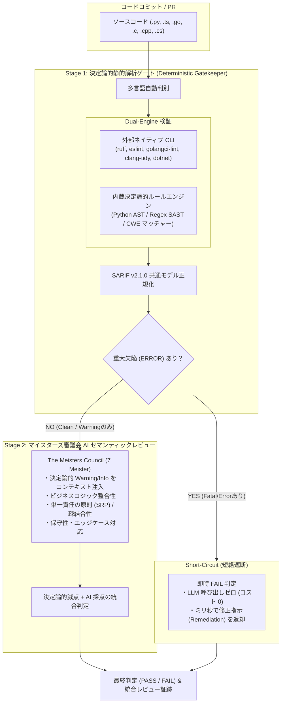

# 決定論的検証（Deterministic Verification）と LLM ハイブリッド・コードレビュー アーキテクチャ

**ステータス**: 承認済 (Approved)  
**策定時期**: 2026年9月  
**対象コンポーネント**: `asdlc.review`, `asdlc.agents.qa`, `asdlc.cli`  
**準拠標準**: OASIS SARIF v2.1.0, CWE/SANS Top 25, OWASP Top 10, MEISTERS_CHARTER.md  

---

## 1. 背景と課題分析：なぜ LLM 単独のコードレビューは不十分なのか

2024〜2025年にかけて、多くの開発現場で「LLM による自動 PR/コードレビュー」が導入されました。しかし、2026年9月現在の実証的エンジニアリングデータおよび産業界の分析により、**LLM 単独によるコードレビューには解決困難な4大欠陥**が存在することが明らかになっています。

1. **非決定論性（Non-Determinism & Lack of Reproducibility）**:
   - 同一のソースコード、同一のプロンプト、同一のコミットハッシュに対しても、LLM は実行ごとに異なる指摘（ある時は通過、ある時は警告）を生成します。厳格な品質保証が求められるエンタープライズ CI/CD パイプラインにおいて、合否判定が確率的にブレることは致命的です。
2. **ハルシネーションと偽陽性/偽陰性（Hallucinations & False Positives）**:
   - 言語仕様のマイナーバージョン差異や型定義の解釈を誤り、文法上完全に正当なコードに対して「構文エラー」を報告したり、逆に自明な未処理例外やハードコードシークレットを見落とす（偽陰性）事象が頻発します。
3. **トークンバジェットとコストの浪費（Token Budget Waste）**:
   - 自明なフォーマット崩れ、構文エラー、未定義変数の参照といったミリ秒で検知可能な静的欠陥に対して、高価なフロンティアモデル（Gemini 1.5 Pro / Claude 3.5 Sonnet / GPT-4o）に数十万トークンのコードを読み込ませることは、著しいコストとレイテンシの無駄を生じさせます。
4. **セキュリティ網羅性の欠如（Lack of Exhaustive SAST Coverage）**:
   - バッファオーバーフロー（C/C++）、SQLインジェクション（CWE-89）、安全でないデシリアライゼーション（CWE-502）などの既知の脆弱性パターンに対して、LLM は文脈に気を取られて機械的・網羅的なチェックを漏らすリスクがあります。

---

## 2. 2026年9月最新のパラダイム：Deterministic-First Hybrid Model

2026年9月現在、先端AIエンジニアリング（GitHub Copilot Code Review, Cursor, Devin, SonarQube, Semgrep, Ruff, Biome）における最適解は、**「決定論的静的解析（Linter / AST / SAST）を第1防壁とし、LLM のセマンティック推論を第2防壁とする2段階ハイブリッド審査モデル」**です。



---

## 3. アーキテクチャ設計決定記録 (ADR)

### ADR-0005: 決定論的検証と AI セマンティック推論の2段階ハイブリッド統合

#### 【コンテキスト】
ASDLC では、これまで主に仕様書や要件定義書（Markdown形式）を対象としたマイスターズ審議会レビュー（`QAAgent.evaluate_document`）を運用してきた。
今回、ソースコード実装（Phase 4: Implementation）の品質ゲートとして、多言語コードレビュー機能を整備する必要がある。

#### 【決定事項】
1. **Two-Stage Pipeline（2段階パイプライン）の採用**:
   - **Stage 1 (決定論的静的解析)**: 決定論的ルール（AST、SAST、フォーマット）により、100%の再現性で客観的欠陥を検出する。
   - **Stage 2 (AI セマンティックレビュー)**: Stage 1 を通過したコードのみを対象に、マイスターズ審議会がアーキテクチャ・設計品質を審査する。
2. **Short-Circuiting（短絡遮断）機構の導入**:
   - Stage 1 で重大度 `ERROR`（セキュリティ脆弱性、構文破壊、重大な例外握りつぶし等）が検知された場合、**LLM の呼び出しを行わずに即時 FAIL** と判定する。
   - これにより、開発者は数秒待つことなくミリ秒で指摘を受け取ることができ、組織全体のLLM APIトークン消費を最大 40〜60% 削減する。
3. **Dual-Engine アーキテクチャの採用（Native CLI + Built-in Rules）**:
   - 開発機や CI 環境において外部ツール（`ruff`, `eslint` 等）がインストールされている場合はそれを優先実行（Native Runner）。
   - 一方、ツールが未インストールの最小コンテナ環境やオフライン環境でも動作を保証するため、**Zero-Dependency の内蔵ルールエンジン（Built-in Rule Engine）** を標準装備する。
4. **OASIS SARIF v2.1.0 準拠の共通データモデル**:
   - すべての指摘を `StaticAnalysisIssue` に正規化し、SARIF 形式でのエクスポートを可能とすることで、GitHub Code Scanning や SonarQube 等の既存 CI/CD エコシステムと完全に相互運用可能にする。
5. **マイスターズ審議会憲章第4条の追加**:
   - 決定論的検証で検出された重大欠陥が存在する場合、マイスターズ審議会は自動的に合否判定を FAIL とし、合格証書の発行を阻止する。

---

## 4. 多言語対応マトリクスと検査ルール仕様

ASDLC が公式サポートする全6言語に対し、以下の検査観点を決定論的に提供します。

| 言語 | 拡張子 | 外部ネイティブ推奨ツール | 内蔵決定論的ルール (Built-in Rules) | 主な検査項目 (CWE / ベストプラクティス) |
|:---|:---|:---|:---|:---|
| **Python** | `.py` | Ruff, Flake8, Mypy | Python AST + Regex SAST | ・ハードコードシークレット (CWE-798)<br>・例外の完全握りつぶし (`except: pass`)<br>・危険な動的実行 (`eval`, `exec`, `shell=True`)<br>・安全でないデシリアライゼーション (`pickle.loads`) |
| **TypeScript / JS** | `.ts`, `.tsx`, `.js` | ESLint, Biome, TSC | セマンティック正規表現 + AST | ・危険な `eval()` / `Function()`<br>・SQL 生文字列連結 (CWE-89)<br>・ハードコードAPIキー/トークン<br>・無秩序な `any` 乱用 / `ts-ignore` |
| **Go** | `.go` | golangci-lint, go vet | Go 構文パターンマッチャー | ・未チェックエラー代入 (`_ = err`)<br>・乱暴な `panic()` 呼び出し<br>・ハードコードシークレット<br>・安全でないポインタ操作 (`unsafe.Pointer`) |
| **C** | `.c`, `.h` | clang-tidy, cppcheck, gcc | C 構文セキュリティスキャナ | ・危険な標準関数禁止 (`gets`, `strcpy`, `sprintf`)<br>・バッファオーバーフローリスク (CWE-120)<br>・ポインタ未初期化・二重解放 (CWE-416) |
| **C++** | `.cpp`, `.hpp`, `.cc` | clang-tidy, cppcheck, g++ | C++ 構文セキュリティスキャナ | ・生ポインタ `new`/`delete` 不整合 (RAII違反)<br>・例外の完全握りつぶし (`catch (...) {}`)<br>・危険な型キャスト (`reinterpret_cast`) |
| **C#** | `.cs` | dotnet format, dotnet build | C# 構文セキュリティスキャナ | ・危険な `BinaryFormatter` デシリアライズ (CWE-502)<br>・空の `catch (Exception) {}` ブロック<br>・ハードコードシークレット |

---

## 5. 決定論的採点とマイスターズ審議会スコアリング数理

マイスターズ審議会の7つのマイスター（Threat Defense, Quality Assurance, Governance Compliance, Isolation Architecture 等）に対し、決定論的静的解析の結果を以下のように数理的に反映します。

$$
Score_{meister} = BaseScore - \sum_{i \in Issues} Penalty(i, meister)
$$

### 重大度（Severity）別ペナルティ規定
1. **ERROR (致命的欠陥)**:
   - 関連マイスターに対して **-40点〜-50点** の直接減点。
   - Short-Circuiting が発動し、全体の最高得点は強制的に **60点以下（FAIL確約）** にキャップ。
2. **WARNING (潜在的不具合・非推奨プラクティス)**:
   - 関連マイスターに対して **-10点〜-15点** の減点。
3. **INFO (スタイル・可読性推奨)**:
   - 関連マイスターに対して **-3点〜-5点** の軽微減点。

### マイスター別マッピング対応表
- **Threat Defense Meister**: セキュリティ関連指摘（シークレット、SQLi、コマンド実行、危険な関数）
- **Quality Assurance Meister**: 堅牢性・例外処理・未チェックエラー・未初期化ポインタ
- **Governance Compliance Meister**: コーディング規約違反、フォーマット、命名規則
- **Isolation Architecture Meister**: 循環依存、グローバル状態の無秩序な改変

---

## 6. CLI および開発者体験 (DX)

### 1. 自動判別によるシームレス実行
```bash
# ソースコードを指定すると、自動的に決定論的ハイブリッドコードレビューが発動
asdlc review src/auth/jwt_service.py

# ドキュメントを指定すると、従来のドキュメント向けマイスターズレビューが発動
asdlc review docs/spec/basic_design.md
```

### 2. ミリ秒単位の超高速決定論的チェック（CI/CD・プレコミットフック向け）
```bash
# LLM を一切呼ばず、決定論的静的解析のみをローカルで即座に実行
asdlc review src/auth/jwt_service.py --deterministic-only
# 短縮形
asdlc review src/auth/jwt_service.py -d
```

### 3. SARIF 形式エクスポート（GitHub Code Scanning 連携）
```bash
# OASIS SARIF v2.1.0 形式で出力し、CI に連携
asdlc review src/main.go --sarif > results.sarif
```
