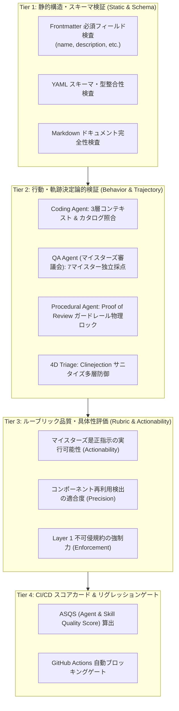

# ASDLC Agent & Skill Quality Evaluation Framework (エージェント＆スキル品質評価フレームワーク)

本書は、AI-SDLC（AI駆動開発ライフサイクル）において、AIエージェント、スキル、規約（ルール）、およびワークフロー（SOP）の品質・信頼性・安全性を定量的かつ決定論的に検証するための **4層統合評価フレームワーク (Multi-Tier Evaluation Architecture)** を定義します。

2026年9月時点の最新業界標準（**SkillsBench** ベンチマーク思想、SWE-bench 多層検証モデル、および対話型AIガードレール評価手法）を取り入れ、生成AIの非決定論的な振る舞いによるデグレや規約違反を CI/CD パイプライン上で 100% 確実に遮断します。

---

## 📐 4層評価アーキテクチャ (Multi-Tier Evaluation Architecture)

本フレームワークは、高速な静的検査から決定論的軌跡検証、セマンティック・ルーブリック評価、そして CI ゲートに至る4つの層（Tier）で構成されます。



---

## 🔍 各評価層（Tier）の検証内容

### Tier 1: 静的構造・スキーマ検証 (Static & Schema Evaluation)
エージェントやスキルの定義ファイルが正しく記述され、開発基盤が期待するインターフェースを満たしているかをミリ秒単位で高速検証します。

| 対象 | ファイルパス | 検証項目 |
| :--- | :--- | :--- |
| **Agents** | `.agents/agents/*.md` | YAML Frontmatter (`name`, `description`), エージェント詳細記述（200文字以上）, 必須ツール群・参照規約のリンク |
| **Skills** | `.agents/skills/*/SKILL.md` | YAML Frontmatter (`name`, `description`), 具体的プロンプト例・手順（300文字以上）, 外部リソース定義 |
| **Rules** | `.agents/rules/*.md` | YAML Frontmatter (`description`, `always_on` or `globs`), 開発制約の明確性（150文字以上） |
| **Workflows** | `.agents/workflows/*.md` | YAML Frontmatter (`title`, `doc_type`), 標準作業手順（SOP）ステップ記述（300文字以上） |

### Tier 2: 行動・軌跡決定論的検証 (Behavior & Trajectory Evaluation)
モックおよびサンドボックス実行により、各エージェントが 2026年最新の AI-SDLC 標準プロトコルに従って行動するかを軌跡（Trajectory）レベルで決定論的に検証します。

1. **Coding Agent 軌跡検証**:
   - `Layer 1: Central Governance`（不可侵規約）が最優先でプロンプトに注入されているか。
   - 社内コンポーネントカタログ（`Layer 2`）から再利用可能な部品（例: `jwt-auth-guard`, `user-table`）が自動発見・推奨されているか。
   - 実装コードの前に受入基準（Given-When-Then）に基づく TDD テストコード先行生成（スキャフォールド）が行われているか。
2. **QA Agent (マイスターズ審議会) 軌跡検証**:
   - 7つの専門マイスター（Threat Defense, Requirement, Operations, QA, Governance, Value, Isolation）が全員独立採点を行っているか。
   - 不備のあるドキュメントに対し、足切り基準（いずれかのマイスターが70点未満）で正しく `FAIL` が宣告されるか。
3. **Procedural Agent ガードレール検証**:
   - 必須成果物や人間の「Proof of Review」承認証跡がない状態でフェーズ昇格（`asdlc advance`）を試みた際、物理的に昇格が阻止されるか。
4. **4D Issue Auto-Triage 軌跡検証**:
   - サプライチェーン攻撃（Clinejection / 間接プロンプトインジェクション）を含む入力が渡された際、悪意ある命令が `[FILTERED_SECURITY_RISK]` に置換され、かつ緊急度（P0/P1）としてフラグ付けされるか。

### Tier 3: ルーブリック品質・具体性評価 (Rubric & Actionability Evaluation)
SkillsBench に準拠したセマンティック・ルーブリックにより、AIが生成する指示・レビュー・規約の「具体性」と「実務有効性」を評価します。

- **Actionability Rubric (実行可能性評価)**:
  マイスターズレビューの是正指示（`recommendations`）が抽象的な助言にとどまらず、章の追加指示、修正ファイル名、形式指定（Given-When-Then、JWT暗号化等）を含む実行可能な指示となっているかをスコアリング。
- **Anti-Reinvention Precision Rubric (車輪の再発明防止適合度)**:
  ユーザー要求からカタログ部品を検出し、重複実装を回避する推薦精度が 100% であるかをスコアリング。
- **Governance Enforcement Rubric (統制規約強制力)**:
  Layer 1 規約（セキュリティ、認証、暗号化、監査ログ）の網羅性と優先順位付けをスコアリング。

### Tier 4: CI/CD スコアカード & リグレッションゲート (CI/CD Regression Gate)
CLI コマンド `asdlc eval` を通じて全評価結果を集約し、総合品質指標 **ASQS** を算出します。

---

## 📊 ASQS (Agent & Skill Quality Score) 数理モデル

全検証項目のスコアから算出される総合指標です。

### 1. 総合スコア算出式
評価対象の全項目数 $N$ に対する平均点として算出されます：

$$\text{ASQS} = \frac{1}{N} \sum_{i=1}^{N} \text{Score}_i \quad (0.0 \le \text{ASQS} \le 100.0)$$

### 2. 合否判定（CI ゲート条件）
ASQS スコアが基準点以上であり、かつ **全検証項目で 1 件の FAIL も存在しない（零許容）** ことが合格の絶対条件です：

$$\text{Verdict} = \begin{cases} \text{PASS} & \text{if } \text{ASQS} \ge 80.0 \land \forall i \in \{1, \dots, N\}, \text{Status}_i = \text{PASS} \\ \text{FAIL} & \text{otherwise} \end{cases}$$

> [!IMPORTANT]
> スコアが 95 点であっても、1つでも `FAIL`（例: ガードレールがすり抜け可能、インジェクション検知漏れ）が存在する場合、総合判定は即時 `FAIL` となり、CI ビルドは exit code 1 で停止します。

---

## 💻 CLI による評価実行方法

### 1. 全体評価の実行 (リッチターミナル出力)
```bash
asdlc eval
```
実行すると、Tier別の集約サマリーテーブルと、各項目の合否・スコア・改善推奨事項がカラー表示されます。

### 2. JSON 形式での出力 (CI/CD 連携用)
```bash
asdlc eval --json
```
JSON 構造体が出力され、GitHub Actions や外部ダッシュボード（Grafana, Datadog）への連携が容易に行えます。

### 3. 対象を絞った評価
```bash
# スキルのみを評価
asdlc eval --target skills

# エージェントのみを評価
asdlc eval --target agents

# Tier 2 (行動・軌跡) のみを評価
asdlc eval --target tier2
```

---

## 🔄 CI/CD パイプライン連携 (`.github/workflows/asdlc-eval.yml`)

GitHub への Push および Pull Request 時に自動起動し、エージェントやスキルの変更による品質低下を自動遮断します。

```yaml
- name: Run ASDLC ASQS Multi-Tier Evaluation
  run: |
    python -m asdlc.cli.main eval
```

判定結果が `FAIL` の場合、プルリクエストのマージは自動的にブロックされます。
