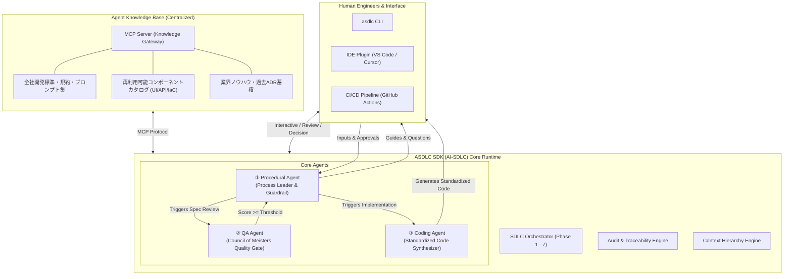

# ASDLC SDK (AI-SDLC) 基本構成案（初版 v1.0）
## 〜 AI駆動開発 × 開発標準化を実現するエンタープライズ向けSDK仕様書 〜

- **策定日**: 2026年9月18日
- **対象リポジトリ**: `v:/repos/sun.flat.yamada/ai-sdlc`

---

## 1. エグゼクティブサマリー & 背景

### 1.1 背景：バイブコーディングの限界と開発標準化の要請
生成AIを活用した「バイブコーディング（Vibe Coding）」は、小規模なプロトタイプ開発では劇的な工数削減を実証しました。しかし、エンタープライズ規模の大規模システム開発においては、以下の構造的な壁に直面します：
1. **トップ層エンジニアへの依存**: 抽象概念と実装を自在に往復できる上位数％のエンジニアしか恩恵を受けられず、組織的な再現性がない。
2. **品質・ガバナンス・セキュリティの崩壊**: 個人の「ノリ」でコードが量産され、厳格な品質基準、トレーサビリティ、コーディング規約、サプライチェーンセキュリティが担保できない。
3. **ドキュメントと仕様の乖離**: 動作するコードだけが先行し、保守運用に不可欠な設計書や仕様書の更新が放置される。

### 1.2 解決策：「ウォーターフォール × AI」による品質担保と工数削減の両立
ASDLC は、アジャイルへの安易な傾斜ではなく、品質管理の歴史を持つ**ウォーターフォールの厳格な工程を踏襲しつつ、各工程の作業時間をAIエージェントで劇的に圧縮・自動化する**アプローチを採用します。
本SDKは、この工学的アプローチを汎用化・体系化し、あらゆるエンタープライズ開発現場で導入可能なオープンで堅牢なSDKとして設計されたものです。

### 1.3 2026年9月時点の最新技術トレンドの反映
- **Model Context Protocol (MCP) の全面採用**: ローカルのルールファイル（`.cursorrules` 等）に依存せず、中央集権の「Agent Knowledge Base」へMCP経由でセキュアに接続。
- **仕様駆動開発（Spec-Driven Development: SDD）**: 「仕様（自然言語やスキーマ）が一次資産であり、コードは派生物」というパラダイムの確立。
- **マルチエージェント・ガバナンスとHuman-in-the-loop (HITL)**: 機械的な品質ゲート（Proof-of-Review）と人間の明示的な承認ゲートを融合。

---

## 2. 先行・類似取り組み（GitHub Repos）の調査と差別化

国内外の先行オープンソースリポジトリおよび実践事例を調査し、本SDKの設計に統合しました。

| リポジトリ / プロジェクト | コアコンセプト | 成果とメリット | 課題・本SDKでの差別化 |
| :--- | :--- | :--- | :--- |
| **MetaGPT**<br>`geekan/MetaGPT` | **Code = SOP(Team)**<br>標準作業手順書（SOP）に基づくマルチエージェント協調 | PRD、システム設計書、タスク分解をエージェント間で自動バトンリレー | アジャイル・フルオート寄り。エンタープライズの「ウォーターフォール7段階工程」と「人間の責任分界点」の統制が不足。本SDKでPhase 1〜7とHITLを完全定義。 |
| **AI-SDLC Framework**<br>`asdlc-framework/asdlc` | **Declarative Governance**<br>YAML/JSONスキーマによる宣言的ガバナンスとQuality Gate | 各工程の受入基準をスキーマ化し、合否判定を自動化 | ガバナンス仕様に特化しており、開発対話エージェントや中央知財再利用エンジンが未統合。本SDKでこれらをワンストップSDK化。 |
| **Yadflow**<br>`abdelrahmannasr/yadflow` | **Gated AI SDLC**<br>人間が各ゲートを動かすCLIツール | ゼロ依存で各ステージの人間承認（Human Gate）を徹底 | エージェントの自律的な問いかけや、ドキュメントの多角的品質評価機能が薄い。本SDKのProcedural Agent / QA Agentで補完。 |
| **Qodo PR-Agent / ce-doc-review** | **Multi-Persona Spec Review**<br>ペルソナ別並列ドキュメント・コードレビュー | 単一LLMのバイアスを排除し、多角的な指摘を構造化レポート化 | レビュー単体ツールにとどまる。本SDKでは「マイスターズレビュー（マイスターズ審議会審査）」としてPhase間の昇格ゲートエンジンに統合。 |
| **AIDLC**<br>`aidlc-io/aidlc` | **VS Code Pipeline Runner**<br>ワークスペース内でのSDLC標準準拠 | 開発者の手元でコンプライアンス基準を自動チェック | ローカル完結型。本SDKではMCPを活用し、組織全体の中央ナレッジベースから知財・規約を動的注入。 |

---

## 3. 6つのペルソナによる協議プロセスとブラッシュアップ

本SDKの基本構成案を固めるにあたり、エンタープライズ開発に関わる6つの専門ペルソナを招集し、設計に対する白熱したレビュー協議を実施しました。

### 3.1 参加ペルソナ
1. **チーフエンタープライズアーキテクト（EA）**: システム拡張性、コンポーザブル化、SDKのAPI抽象化を追求。
2. **AIエージェント・オーケストレーションエンジニア（AOE）**: ステートマシン、SOP実行、イベント駆動、MCP統合を担当。
3. **QA・品質保証ディレクター（QAD）**: マイスターズレビューの精度、評価基準（ルーブリック）、ハルシネーション抑止を重視。
4. **リードデベロッパー / DXスペシャリスト（DXS）**: 「意識させない標準化」と開発者体験、CLI/IDEの使い心地を検証。
5. **デリバリー & PMOリード（PMO）**: 「人間は怠ける」ガードレール、工数削減可視化、監査証跡（Audit Trail）を管理。
6. **セキュリティ & コンプライアンスオフィサー（SCO）**: AI生成物の著作権リスク、サプライチェーン、MCPアクセス制御を統制。

### 3.2 協議のハイライトとブラッシュアップ内容

```
[協議のハイライト]
PMO: 「『人間は怠ける』という前提は痛いほど分かる。エンジニアは締切に追われるとAIが作ったドキュメントを読まずに承認ボタンを連打する。これをどう防ぐのか？」
AOE: 「Procedural Agentに『Proof of Review（レビュー証跡）』プロトコルを入れましょう。AIが作成した草案に対し、特定箇所の整合性確認や要件選択肢の回答を人間に入力させ、必須入力が揃わない限り次工程への移行コマンドを物理的にロックします。」

QAD: 「QA Agentの『マイスターズレビュー（マイスターズ審議会審査）』は素晴らしいが、7つのLLMが毎回自由形式で感想を述べ合うと、評価がブレて合否判定が不安定になる。また7並列はコストと時間がかかる。」
EA: 「Tier 1（静的スキーマ・リンター）と Tier 2（マイスターズ審議会LLM並列評価）の2段階パイプラインにすべきだ。フォーマット不備はTier 1で即座に弾き、Tier 2ではPydanticで型定義された構造化スコア（100点満点＋評価根拠＋修正コード/差分案）を返させよう。さらに各マイスターの意見を総括する『調停者（Moderator Agent）』を配置してブレを平滑化する。」

DXS: 「Coding Agentの『エンジニアに意識させない標準化』は、現場のエンジニアにとって窮屈にならないか？勝手にコードを書き換えられたら反発が起きる。」
SCO: 「3層のコンテキスト階層（Central Governance > Project Catalog > Developer Prompt）を明示的に設計しよう。セキュリティと組織共通コンポーネント（認証やUI部品）は最優先だが、ビジネスロジックはエンジニアの指示を尊重する。さらに、既存コンポーネントがある場合は『車輪の再発明』を防ぐために自動で候補を提示してコードに組み込む仕様にする。」
```

### 3.3 協議によるブラッシュアップ確定事項
1. **Proof-of-Review（対話型ガードレール）**: 人間の受動的承認を排除し、AIからの能動的質問への回答をトリガーとする。
2. **Two-Tier マイスターズ審議会評価エンジン**: 静的検証（高速・安価）＋構造化ルーブリックLLM並列評価（高精度・説明責任）＋調停者エージェント。
3. **3層コンテキスト優先制御（Context Priority Hierarchy）**: ガバナンス規約 > 知財コンポーネントカタログ > 開発者ローカル指示。
4. **MCP (Model Context Protocol) サーバー標準装備**: 中央ナレッジ（Agent Knowledge Base）と開発環境を疎結合に保ち、全社知財を一元配信。
5. **不変監査ログ（Immutable Audit Trail）**: AIと人間がいつ、何をレビューし承認したかをGitコミットおよび署名付きJSONで永続化。

---

## 4. ASDLC SDK (AI-SDLC) 基本構成案（初版 仕様書）

### 4.1 システム全体アーキテクチャ



---

### 4.2 コアエージェント詳細仕様

#### ① Procedural Agent（プロセス主導・ガードレール）
- **役割**: ウォーターフォールPhase 1〜7を自律進行させ、人間の怠けを防ぐガードレールとして機能。
- **責務マトリクス（docs/assets/images/29220_b.png 準拠）**:
  - **Phase 1: 要件定義**
    - タスク: ビジネス要件 / 機能要件 / 非機能要件
    - 成果物: `requirements.md`
    - AI: 既存コード解析・要件草案生成・不足情報の能動的ヒアリング
    - 人間: 開発方針伝達・質問への回答・草案レビュー・整合性確認・修正
  - **Phase 2: 基本設計**
    - タスク: アーキテクチャ設計 / 技術スタック選定 / ADR作成
    - 成果物: `basic_design.md`, `ADR-*.md`
    - AI: 設計書草案生成・アーキテクチャ代替案提示・トレードオフ分析
    - 人間: 設計方針決定・レビュー・技術選定承認
  - **Phase 3: 詳細設計**
    - タスク: API・データモデル・インフラ設計 / プロジェクトセットアップ
    - 成果物: `openapi.yaml`, `schema.prisma`, `task_breakdown.json`
    - AI: タスク分解支援・テスト方針提案・Issue自動生成
    - 人間: タスク優先度決定・リソース計画・実行計画承認
  - **Phase 4: 反復開発**
    - タスク: User Story Issue消化 → TDD → 実装 → コードレビュー → CI/CDマージ
    - 成果物: 実装コード, `Pull Request`
    - AI: Coding Agent連携・単体テスト先行生成・CI/CD/IaC設定生成
    - 人間: PR内容レビュー・実動作確認・セキュリティ確認
  - **Phase 5: 結合テスト**
    - タスク: 統合テスト / E2Eテスト / 負荷テスト
    - 成果物: テストコード, `test_report.md`
    - AI: テストシナリオ生成・自動実行・バグ原因分析と修正パッチ提案
    - 人間: テスト観点レビュー・合否判定・品質基準判定
  - **Phase 6: 本番リリース**
    - タスク: リリース作成 / 承認フロー / 本番デプロイ
    - 成果物: `release_notes.md`, `deploy_audit.json`
    - AI: データ移行スクリプト生成・環境設定検証
    - 人間: データ移行承認・本番デプロイ最終承認
  - **Phase 7: 保守運用**
    - タスク: 監視・アラート / 障害復旧 / ドキュメント保守
    - 成果物: 改善PR, `runbook.md`
    - AI: モニタリング設定自動化・障害ログ解析・改善提案
    - 人間: リリース判断・運用体制構築・最終意思決定

#### ② QA Agent（マイスターズ審議会・マイスターズレビュー (The Council of Meisters)）
- **役割**: ドキュメント成果物をマルチペルソナで評価し、合格基準を満たさない限り次工程への移行を完全ブロック。
- **マイスターズ審議会のマイスター定義 (Standard Meisters)**:
  1. **Threat Defense Meister**: 脅威・リスク対策。脆弱性・不確実性の脅威残存ゼロ、認証・暗号化、シークレット漏洩の徹底排除に責任を持ち、多角的なリスク対策視点で監視・改善。
  2. **Requirement Fulfillment Meister**: 要求仕様定義。要求の仕様化責任を担い、ビジネス要求・ユーザー要求の完全充足、境界値・エッジケース網羅（合理的推測）を監視・改善。
  3. **Pragmatic Operations Meister**: リアルな現場運用。本番実運用の現実性、可観測性（ログ・監視・アラート）、ランブック具体性に責任を持ち、曖昧な箇所の残存を監視・改善。
  4. **Quality Assurance Meister**: 品質保証。受入基準（Given-When-Then）、客観的テスト可能性、品質メトリクスに責任を持ち、検証可能性を監視・改善。
  5. **Governance Compliance Meister**: 規律統制・説明責任。全社開発標準・規約準拠、ADR意思決定経緯の透明性と説明に責任を持ち、意思決定材料の網羅性を監視・改善。
  6. **Value Proposition Meister**: ビジネス価値提供。真の顧客価値創出、ROI、市場競争優位性、過剰/不足設計の排除に責任を持ち、市場で勝てる提案かを監視・改善。
  7. **Isolation Architecture Meister**: 疎結合なClean Architecture。疎結合性、コンポーザブル部品化、知財再利用徹底に責任を持ち、生成AIによる反復変更での劣化最小化を監視・改善。
- **合否判定アルゴリズム**:
  - 各マイスターが100点満点で採点。加重平均スコア ≧ 80点 かつ 全マイスター個別スコア ≧ 70点 で「PASS」。
  - 「FAIL」時は、各マイスターから具体的な修正指示（指摘箇所、修正文案、理由）を提示し、Procedural Agentが修正セッションを開始。

#### ③ Coding Agent（意識させない標準化 & コンポーザブル再利用）
- **役割**: ナレッジベースの規約・既存部品を最優先し、エンジニアが意識せずとも標準化されたコードを合成。
- **3層コンテキスト優先エンジン**:
  - `Layer 1 (Hard Rules)`: 全社セキュリティ・ライセンス・禁止構文（オーバーライド不可）
  - `Layer 2 (Architecture & Catalog)`: 社内再利用コンポーネント（認証、UIコンポーネント、ロギング等）の自動マッピング
  - `Layer 3 (Developer Intent)`: 開発者が入力したプロンプト・個別ビジネスロジック
- **コンポーザブルアーキテクチャ実現機構**:
  - 機能実装要求を受け取ると、MCP経由で `ComponentRegistry` をセマンティック検索。
  - 一致度が高い既存部品（例: 社内標準JWT認証、共通テーブルUI等）を検知した場合、車輪の再発明を行わずインポートコードを生成。

---


### 4.4 Issue Autoトリアージ機能仕様 (2026年9月最新仕様)
- **サニタイズ層 (Sanitization)**:
  2026年最新の脅威（Clinejectionなどの間接プロンプトインジェクション）に対応。Issueタイトル・本文内の悪意あるインストラクション構文を無毒化し、CI/CDキャッシュや機密情報の漏洩を遮断。
- **4次元分析 (4D Triage)**:
  1. `Type`: Bug / Feature / Refactor / Security / Question / Chore
  2. `Priority`: P0 (Critical/Blocker) / P1 (High) / P2 (Medium) / P3 (Low)
  3. `Component`: 該当コンポーネント推定、過去ADR・設計書との照合
  4. `Actionable Next Steps`: 不足情報要求テンプレート、アサイン推奨ロール、暫定回避策

### 4.5 SDK パッケージ構造案

```
ai_sdlc/
├── __init__.py
├── orchestrator.py           # SDLC 全体オーケストレーター
├── state.py                  # SDLC 状態管理・チェックポイント
├── context.py                # 3層コンテキスト階層エンジン
├── agents/
│   ├── __init__.py
│   ├── procedural/           # ① Procedural Agent
│   │   ├── agent.py
│   │   ├── guardrail.py      # Proof of Review 実装
│   │   └── phases.py         # Phase 1〜7 定義
│   ├── qa/                   # ② QA Agent
│   │   ├── agent.py          # マイスターズ審議会オーケストレーター
│   │   ├── sages.py          # 各マイスターの個別プロンプト & 評価器
│   │   └── moderator.py      # 調停・総合判定
│   └── coding/               # ③ Coding Agent
│       ├── agent.py
│       ├── catalog.py        # コンポーネントレジストリ連携
│       └── policy.py         # 規約・セキュリティ強制注入
├── mcp/                      # Model Context Protocol クライアント
│   ├── client.py             # MCP 接続クライアント
│   └── tools.py              # Knowledge Base 探索ツール
└── cli/                      # CLI インターフェース
    └── main.py               # コマンドライン実行エントリポイント
```

---

## 5. 開発現場における「10の構造変化」への対応

AI駆動開発の本格導入に伴い、ソフトウェア開発現場では次のような本質的な「10の構造変化」が生じます。本SDKは、これらをアーキテクチャおよびワークフローレベルで支える設計となっています。

| 変化の区分 | 発生する構造変化 | ASDLC SDK (AI-SDLC) での実現・実装機能 |
| :--- | :--- | :--- |
| **作業の変化** | ① 人の役割が「書く」から「レビュー・意思決定・方向づけ」に | Procedural Agent が草案を作成し、人間は Proof-of-Review による承認・修正に専念。 |
| | ② 成果物の主役が「ソースコード」から「意図・仕様」に | 仕様書（Markdown/OpenAPI）を一次資産として管理。コードはCoding Agentによる再現可能な派生物とする。 |
| | ③ テスト・検証が「後工程」から「前提条件」に | Phase 4 実装前に、Phase 3/4 でテストコード・受入条件を自動先行生成（TDD強制）。 |
| | ④ 保守運用の自動化が前提となる | Phase 7 の監視設定（IaC/Alert）、障害自己診断スクリプトを開発フェーズから同時生成。 |
| **品質の変化** | ⑤ 要件定義書、各種設計書等のドキュメントが必ず生成される | ドキュメントが存在しQA Agent（マイスターズ審議会）の合格が出ない限り次工程に進めないパイプライン制御。 |
| | ⑥ 開発標準化、コンポーザブルアーキテクチャ等が実現 | MCP経由の中央コンポーネントカタログから既存知財を自動再利用。車輪の再発明を撲滅。 |
| | ⑦ ガバナンス・セキュリティが「作り込み」から「組み込み前提」に | 3層コンテキストの最上位（Layer 1）に全社セキュリティポリシーを強制バインド。 |
| | ⑧ 属人性が低下 | 暗黙知をMCP Knowledge Baseに形式知化し、一般層エンジニアでもトップ層水準の品質を担保。 |
| **意識の変化** | ⑨ 試行錯誤コストが下がり、開発文化が「探索的」に | Procedural Agentが複数のアーキテクチャADR案を瞬時に提示し、比較検討を容易化。 |
| | ⑩ 参加者の裾野が広がり、システム開発が民主化 | 自然言語による対話型要件定義により、企画・非エンジニアもSDLCプロセスに直接参画可能。 |

---

## 6. 実装ロードマップ

1. **Step 1（コアSDK基盤の構築）**:
   - `asdlc` Python パッケージの初期化
   - Phase 1〜7 のステートマシンと成果物スキーマ定義
2. **Step 2（3大エージェント実装）**:
   - `ProceduralAgent`: 対話型ヒアリングとProof-of-Reviewガードレール
   - `QAAgent`: マイスターズ審議会の個別プロンプトとTwo-Tier構造化スコアリングエンジン
   - `CodingAgent`: MCPクライアントと3層コンテキスト合成エンジン
3. **Step 3（CLIツール・サンプルプロジェクト提供）**:
   - `asdlc init`, `asdlc advance`, `asdlc review`, `asdlc code` コマンド
   - 決定論的コードレビューエンジンおよびSARIF出力機能

---

## 7. 参考文献 (References)

1. **産業界におけるAI駆動開発・標準化先行事例**:
   - ウォーターフォール工程へのAI適用・工数圧縮に関する実証研究（例: トランスコスモス「Waterfall Boost」CodeZine掲載事例など）
2. **Model Context Protocol (MCP)**: Anthropic Specification (<https://modelcontextprotocol.io/>)
3. **仕様駆動開発（Spec-Driven Development）**: IEEE ソフトウェアエンジニアリング標準


